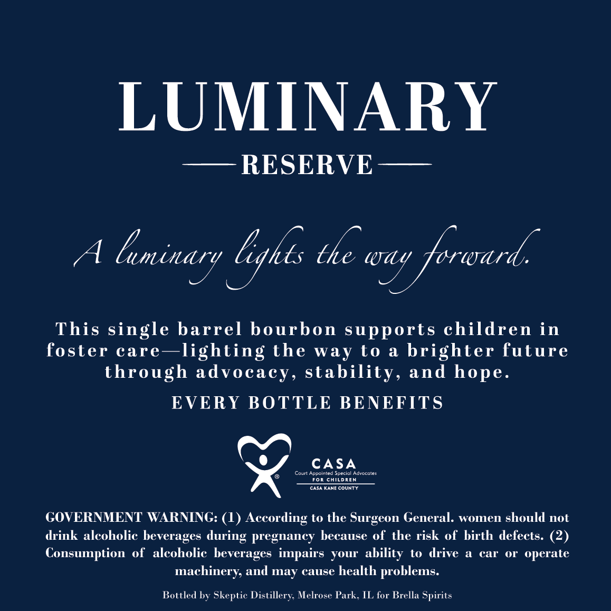
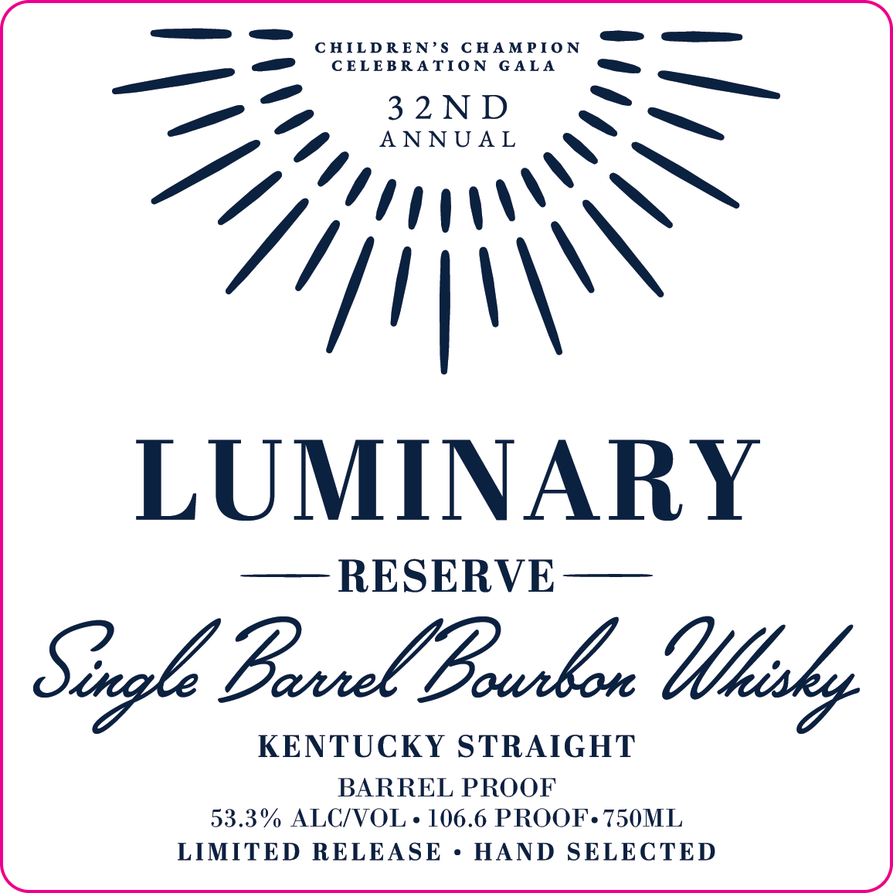

# TTB COLA Label Images - TTBID 26060001000084

**Brand Name:** LUMINARY RESERVE

**Fanciful Name:** SINGLE BARREL BOURBON

**Issue Date:** 03/04/2026

**Origin Code:** 04

**Product Class/Type:** 101

**Source:** [TTB Public COLA Registry](https://ttbonline.gov/colasonline/viewColaDetails.do?action=publicFormDisplay&ttbid=26060001000084)

## Label Images

### Back Label

### Front Label

## Extracted Label Text

*Text extracted via OCR - may contain errors*

**Detected Proof:** 106.6

### Back Label

LUMINARY
RESERVE
A
lminary lykts te wag forward
This single barrel bourbon supports children in
foster care ~lighting the
way t0
a
brighter future
through advocacy, stability, and hope.
EVERY BOTTLE BENEFITS
CASA
Appcinted
Special
Cdeatn
CHILdREN
CaSA KANE COUNTY
GOVERNMENT WARNING: (1) According to the Surgeon General
women should not
drink alcoholic heverages
pregnancy hecause of the risk of hirth defects: (2)
Consumption of
alcoholic beverages ipairs YOur  ability
to drive
car
OT
operate
machinery; and may cause health problems:
Bottled by Skeptic Distillery; Melrose Park , IL for Brella Spirits
Coutt
during

### Front Label

CHILDREN'$
C HAMPIO N
CELEBRA TIO N
G ALA
3 2 N D
A N N U A L
LUMINARY
RESERVE
Sngle Bamxel Bukon
KENTUCKY STRAIGHT
BARREL PROOF
53.3% ALCIVOL
106.6 PROOF. 750ML
LIMITED RELEASE
HAND SELECTED
=
Iftisky
