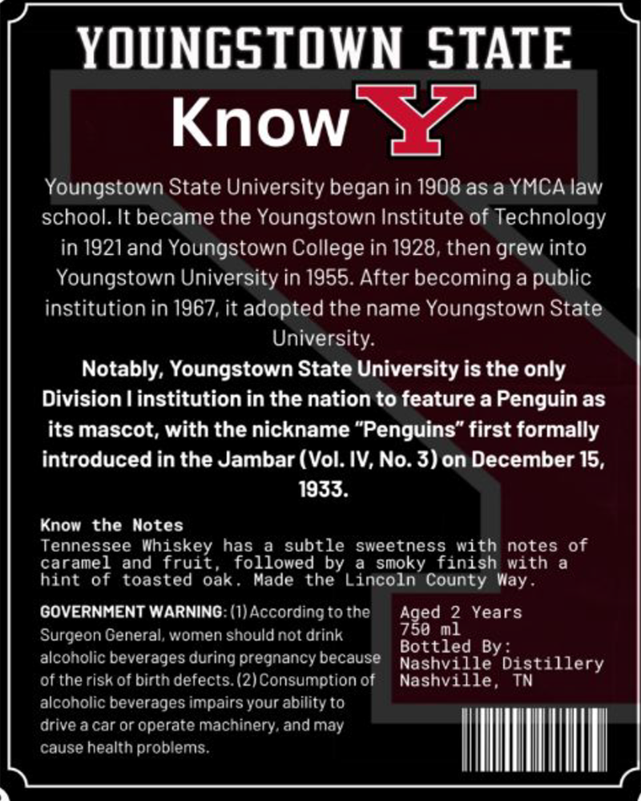
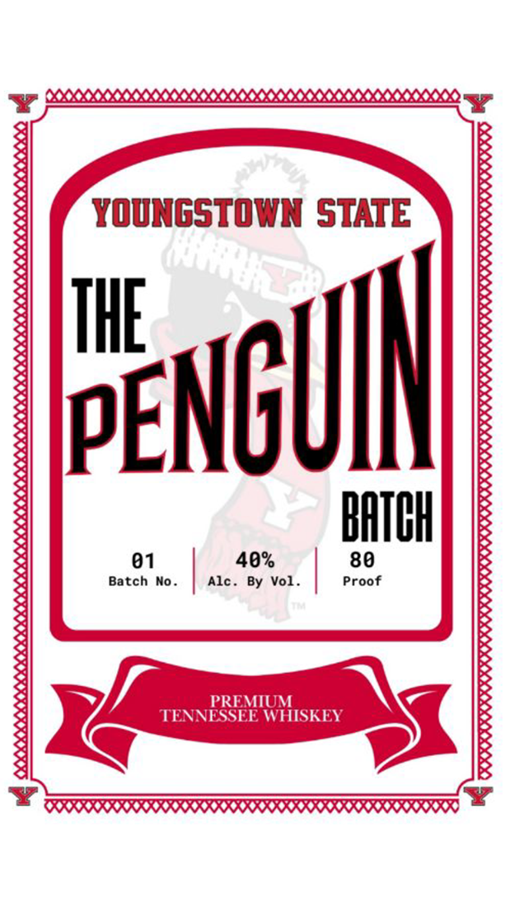

# TTB COLA Label Images - TTBID 26060001000114

**Brand Name:** YOUNGSTOWN STATE THE PENGUIN

**Issue Date:** 03/02/2026

**Origin Code:** 43

**Product Class/Type:** 140

**Source:** [TTB Public COLA Registry](https://ttbonline.gov/colasonline/viewColaDetails.do?action=publicFormDisplay&ttbid=26060001000114)

## Label Images

### Back Label

### Front Label

## Extracted Label Text

*Text extracted via OCR - may contain errors*

**Detected Proof:** 80

### Back Label

YOUNGSTOWN STATE

Know SZ

Youngstown State University began in 1908.as a YMCA law

school. It became the Youngstown Institute of Technology

in 1921 and Youngstown College in 1928, then grew into

Youngstown University in 1955. After becoming a public

institution in 1967, it adopted the name Youngstown State

University.

Notably, Youngstown State University is the only

Division | institution in the nation to feature a Penguin as

its mascot, with the nickname “Penguins” first formally

introduced in the Jambar (Vol. IV, No. 3) on December 15,

1933.

Know the Notes

caramel and fruit, followed by a smoky finish with a

Tennessee Whiskey has a subtle sweetness with notes of

hint of toasted oak. Made the Lincoln County Way.

GOVERNMENT WARNING: (1) According to the

Aetas Years

Surgeon General, women should not drink

jottled By:

alcoholic beverages during pregnancy because

Nashville Distillery

of the risk of birth defects. (2) Consumption of

Nashville,

alcoholic beverages impairs your ability to

drive a car or operate machinery, and may

cause health problems.

|

IM

|

### Front Label

YOUNGSTOWN STATE

pENGL

t)

40%

BATCH

Proof
