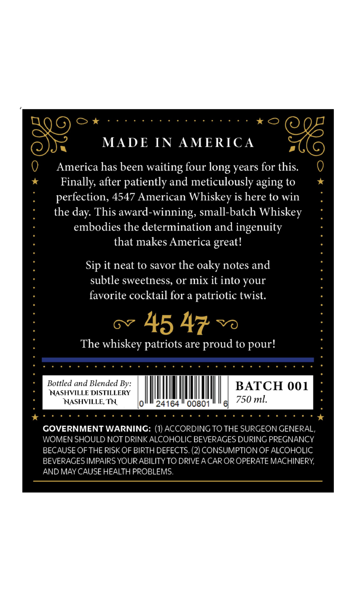
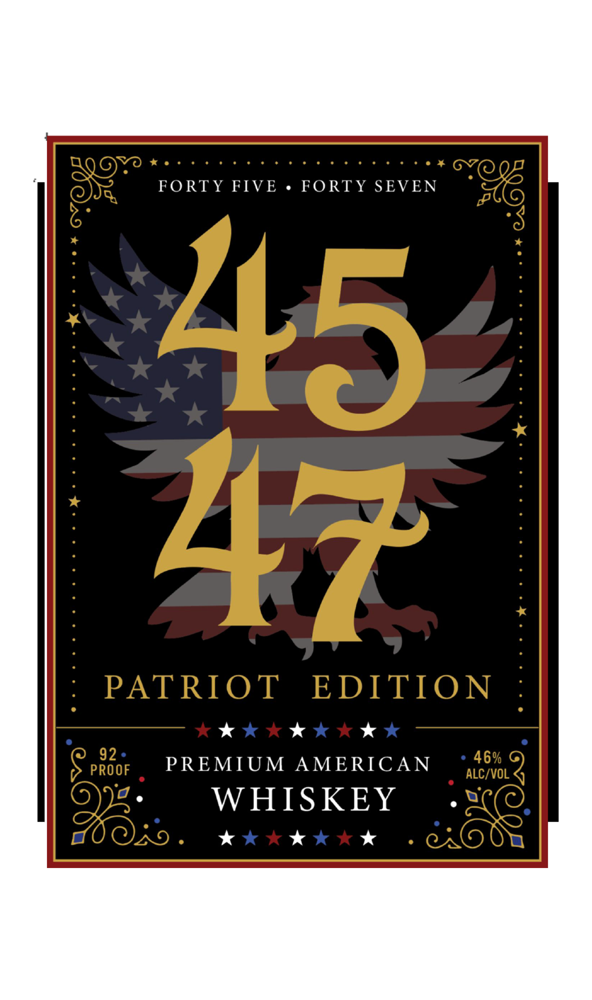

# TTB COLA Label Images - TTBID 26060001000118

**Brand Name:** 4547

**Issue Date:** 03/04/2026

**Origin Code:** 43

**Product Class/Type:** 140

**Source:** [TTB Public COLA Registry](https://ttbonline.gov/colasonline/viewColaDetails.do?action=publicFormDisplay&ttbid=26060001000118)

## Label Images

### Back Label

### Front Label

## Extracted Label Text

*Text extracted via OCR - may contain errors*

**Detected Proof:** 92

### Back Label

MADE
IN
AMERIC A
America has been waiting four
years for this.
Finally, after patiently and meticulously aging to
perfection, 4547 American Whiskey is here to win
the
This award-winning, small-batch Whiskey
embodies the determination and ingenuity
that makes America great!
it neat to savor the
notes and
subtle sweetness, or mix it into your
favorite cocktail for a
patriotic twist.
45 47
The
whiskey patriots are proud to pour!
Bottled and Blended By:
BATCH 001
NASHVILLE DISTILLERY
NASHVILLE; TN
0
24164
00801
61
750 ml.
GOVERNMENT WARNING: (1) ACCORDING TO THE SURGEON GENERAL,
WOMEN SHOULD NOT DRINKALCOHOLIC BEVERAGES DURING PREGNANCY
BECAUSE OF THE RISK OF BIRTH DEFECTS. (2) CONSUMPTION OF ALCOHOLIC
BEVERAGES IMPAIRS YOURABILITY TO DRIVE A CAR OR OPERATE MACHINERY
AND MAY CAUSE HEALTH PROBLEMS:
long
day:
Sip
oaky

### Front Label

FORTY FIVE
FORTY SEVEN
45
PATRIOT
EDITION
92
PREMIUM
AMERICAN
46%
PROOF
ALC/VOL
WHISKEY
