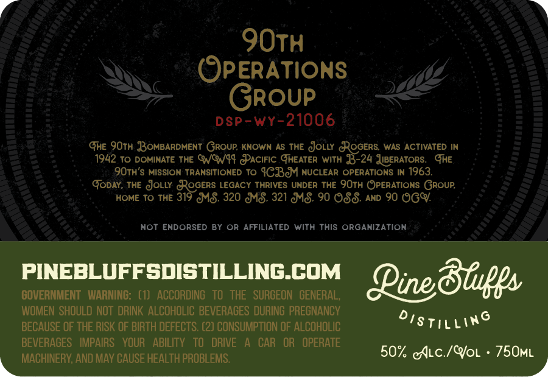
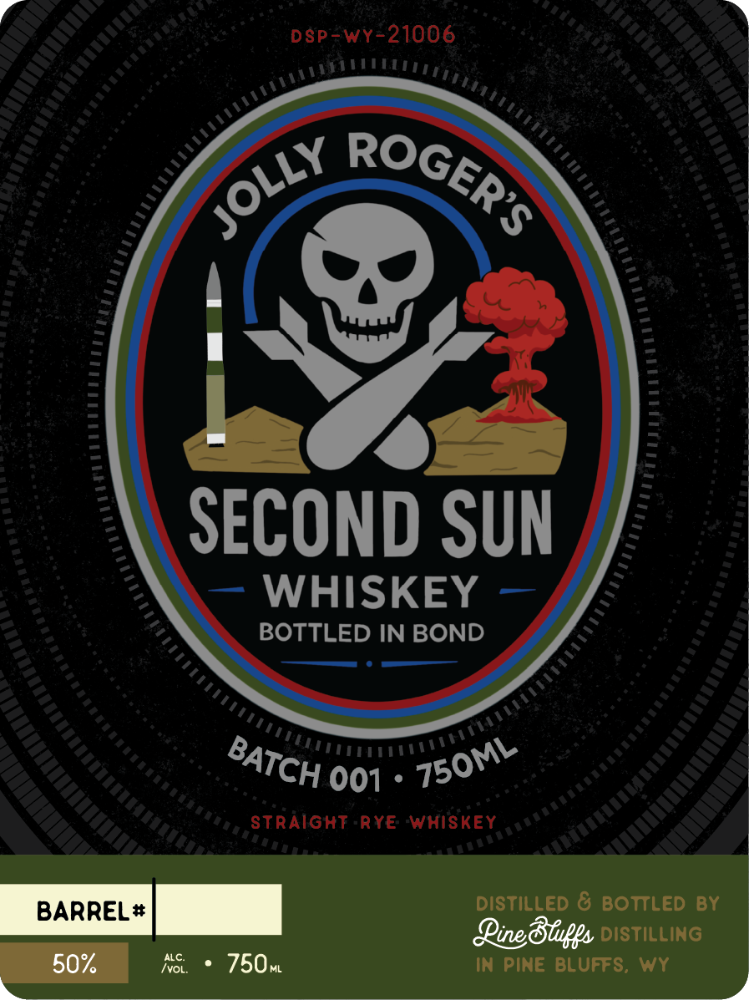

# TTB COLA Label Images - TTBID 26061001000168

**Brand Name:** PINE BLUFFS DISTILLING

**Fanciful Name:** JOLLY ROGER'S SECOND SUN

**Issue Date:** 03/03/2026

**Origin Code:** 49

**Product Class/Type:** 119

**Source:** [TTB Public COLA Registry](https://ttbonline.gov/colasonline/viewColaDetails.do?action=publicFormDisplay&ttbid=26061001000168)

## Label Images

### Back Label

### Front Label

### Label 4

## Extracted Label Text

*Text extracted via OCR - may contain errors*

*1 image(s) excluded: text did not meet readability threshold*

### Back Label

90TH

(QPERATIONS

Group

Dsp-wy-21006

Ge 9OTH BOMBARDMENT GROUP, KNOWN AS THE cJOLLY GROGERS, WAS ACTIVATED IN

1942 To DOMINATE THE QVCW44 PACIFIC GHEATER WITH 35-24 JiBERATORS. GHE

QOTH’S MISSION TRANSITIONED TO {GBM NUCLEAR OPERATIONS IN 1963.

Goony, THE gOLuy.

{OGERS LEGACY THRIVES UNDER THE 90TH OPERATIONS GROUP,

HOME To THE 319 MS. 320 MS. 321 MS. 90 OSS. ann 90 OGY.

NOT ENDORSED BY OR AFFILIATED WITH THIS ORGANIZATION

PINEBLUFFSDISTILLING.COM

GOVERNMENT WARNING: (1) ACCORDING TO THE SURGEON GENERAL,

Line Bluffs

WOMEN SHOULD NOT DRINK ALCOHOLIC BEVERAGES DURING PREGNANCY

BECAUSE OF THE RISK OF BIRTH DEFECTS. (2) CONSUMPTION OF ALCOHOLIC

rst iLL

BEVERAGES IMPAIRS YOUR ABILITY TO DRIVE A CAR OR OPERATE

50% Atc./Yor - 750mMi

q MACHINERY, AND MAY CAUSE HEALTH PROBLEMS.

### Front Label

psp=wy-21006

\X RO

CE

Yous

SECOND SUN

— WHISKEY —

BOTTLED IN BOND

Src 001: 4500

STRAIGHT -RYE WHISKEY

“sumees]

DISTILLED & BOTTLED BY

50% AS + 750m

QRine Bluffs 106

IN PINE BLUFFS, WY
