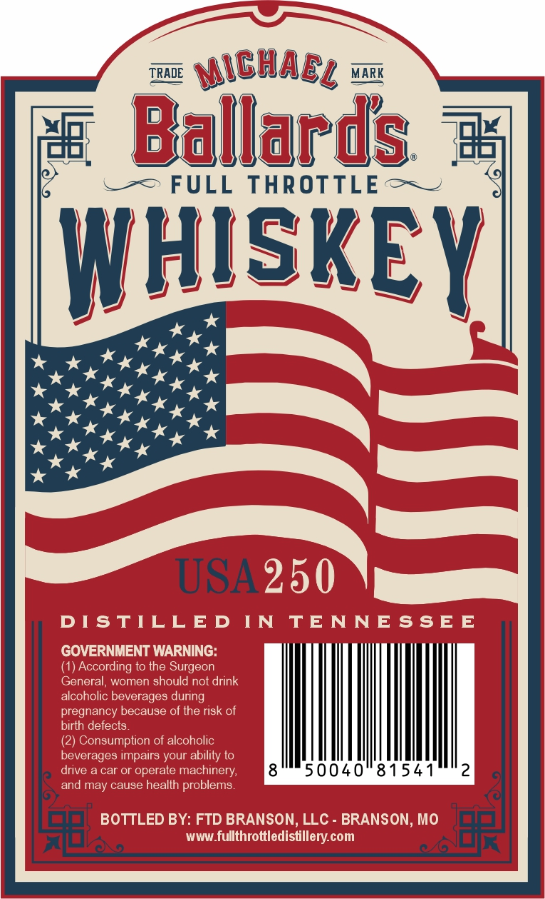

# TTB COLA Label Images - TTBID 26061001000217

**Brand Name:** FULL THROTTLE

**Issue Date:** 03/03/2026

**Origin Code:** 29

**Product Class/Type:** 140

**Source:** [TTB Public COLA Registry](https://ttbonline.gov/colasonline/viewColaDetails.do?action=publicFormDisplay&ttbid=26061001000217)

## Label Images

### Back Label

### Front Label

### Label 3

## Extracted Label Text

*Text extracted via OCR - may contain errors*

*1 image(s) excluded: text did not meet readability threshold*

### Back Label

TRADE om NCHARy a MARK

win

a\8

‘Ballards °

L=-=> FULL THROTTLE ~~~

HISKE

rite

Ky AK

kok

x” *

Ky

” *

Kx

ahs

Kyo

x *

USA

Nt

wh}

50040 81541

aint

Is.

ult

re i:

### Front Label

TRADE ISlARs = MARK

ay Ballanis =

.-=> FULL THROTTLE + ~

SKE

ae

Y

omits

STABLISHED

Te SAL OLORS oe

SS

SA nm sits ANTES NS

kkk

kkk

1776-2026

2250

ANNIVERSARY C

: TUES

SLEUSEA reer sn envEekolenes®

Pa

a

sah

Lp
