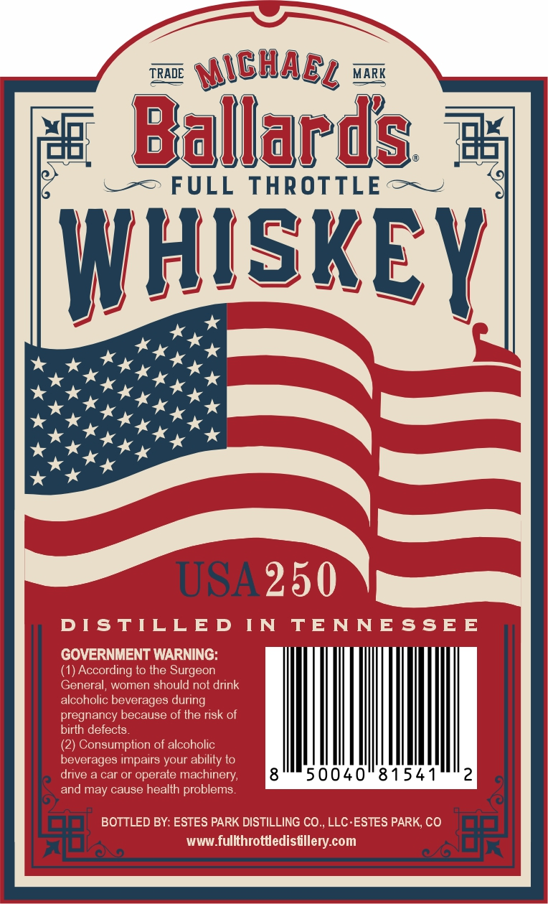

# TTB COLA Label Images - TTBID 26061001000222

**Brand Name:** FULL THROTTLE

**Issue Date:** 03/04/2026

**Origin Code:** 13

**Product Class/Type:** 140

**Source:** [TTB Public COLA Registry](https://ttbonline.gov/colasonline/viewColaDetails.do?action=publicFormDisplay&ttbid=26061001000222)

## Label Images

### Back Label

### Front Label

### Label 3

## Extracted Label Text

*Text extracted via OCR - may contain errors*

*1 image(s) excluded: text did not meet readability threshold*

### Back Label

TRADE
MicHacl
MARK
Ballards ;
FULL
THROTTLE
WHISREY

USA 250

DI STILLED
IN
TE NNESSEE
GOVERNMENT WARNING:
(1) According to the Surgeon
General,
women
should not drink
alcoholic beverages
pregnancy because of the risk of
birth defects
(2) Consumption of alcoholic
beverages irpairs your abilily lo
drive
car or operate
machinery;
50040"81541
2
and may cause health problems
BOTTLED BY: ESTES PARK DISTILLING CO, LLC ESTES PARK, CO
WWW_
fullthrottledistllery com
during

### Front Label

TRADE ISlARs = MARK

ay Ballanis =

.-=> FULL THROTTLE + ~

SKE

ae

Y

omits

STABLISHED

Te SAL OLORS oe

SS

SA nm sits ANTES NS

kkk

kkk

1776-2026

2250

ANNIVERSARY C

: TUES

SLEUSEA reer sn envEekolenes®

Pa

a

sah

Lp
