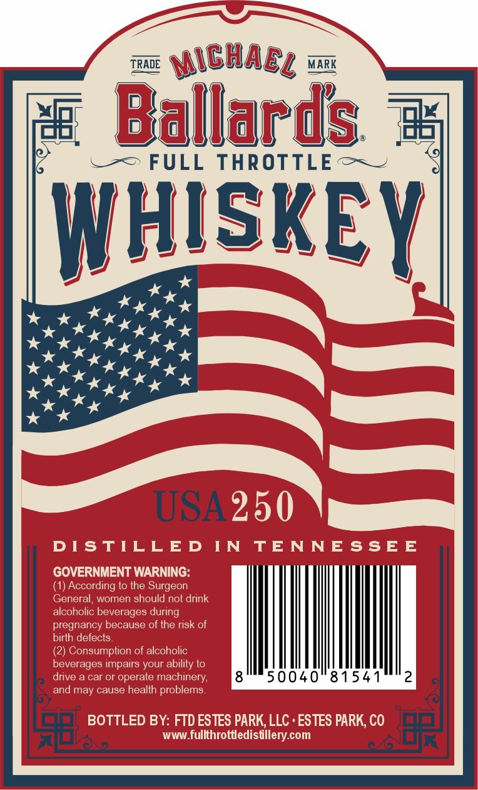

# TTB COLA Label Images - TTBID 26061001000228

**Brand Name:** FULL THROTTLE

**Issue Date:** 03/03/2026

**Origin Code:** 13

**Product Class/Type:** 140

**Source:** [TTB Public COLA Registry](https://ttbonline.gov/colasonline/viewColaDetails.do?action=publicFormDisplay&ttbid=26061001000228)

## Label Images

### Back Label

### Front Label

### Label 3

## Extracted Label Text

*Text extracted via OCR - may contain errors*

*1 image(s) excluded: text did not meet readability threshold*

### Back Label

wa NCHABy ox
“ws «OB ”
# Ballards 3
oa C==> FULL THROTTLE GW
W Dx Y
KX |
PING T
RII KI
ana KK Ns ‘
OK EKG
dnas Kx J
ees
everages impairs your ably Wht
nor cases potema 12
ool BOTTLED BY: FTD ESTES PARK, LLC - ESTES PARK, CO jo
lA. www .fullthrottledistille m rl RK

### Front Label

TRADE ISlARs = MARK

ay Ballanis =

.-=> FULL THROTTLE + ~

SKE

ae

Y

omits

STABLISHED

Te SAL OLORS oe

SS

SA nm sits ANTES NS

kkk

kkk

1776-2026

2250

ANNIVERSARY C

: TUES

SLEUSEA reer sn envEekolenes®

Pa

a

sah

Lp
