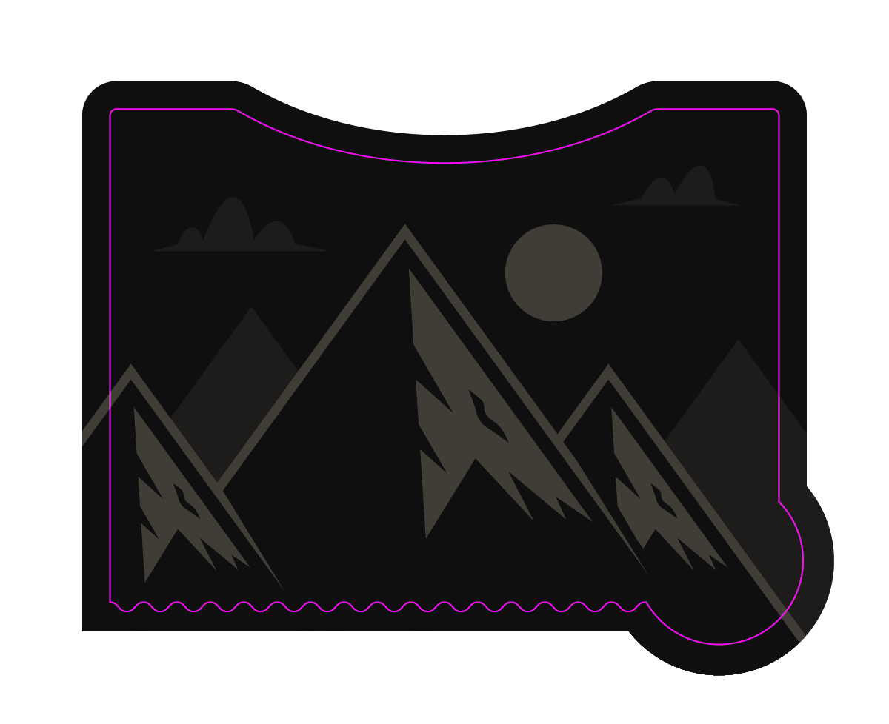
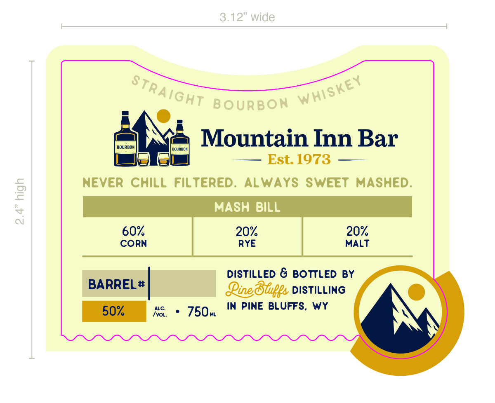

# TTB COLA Label Images - TTBID 26061001000657

**Brand Name:** PINE BLUFFS DISTILLING

**Fanciful Name:** MOUNTAIN INN BAR

**Issue Date:** 03/03/2026

**Origin Code:** 49

**Product Class/Type:** 101

**Source:** [TTB Public COLA Registry](https://ttbonline.gov/colasonline/viewColaDetails.do?action=publicFormDisplay&ttbid=26061001000657)

## Label Images

### Back Label

### Front Label

### Label 4

## Extracted Label Text

*Text extracted via OCR - may contain errors*

*2 image(s) excluded: text did not meet readability threshold*

### Front Label

she;
Mountain Inn Bar
= 2 — Est.1973 ——
NEVER CHILL FILTERED. ALWAYS SWEET MASHED.
MASH BILL
CORN RYE MALT
DISTILLED & BOTTLED BY

BARREL* Line Stuffs DISTILLNG
