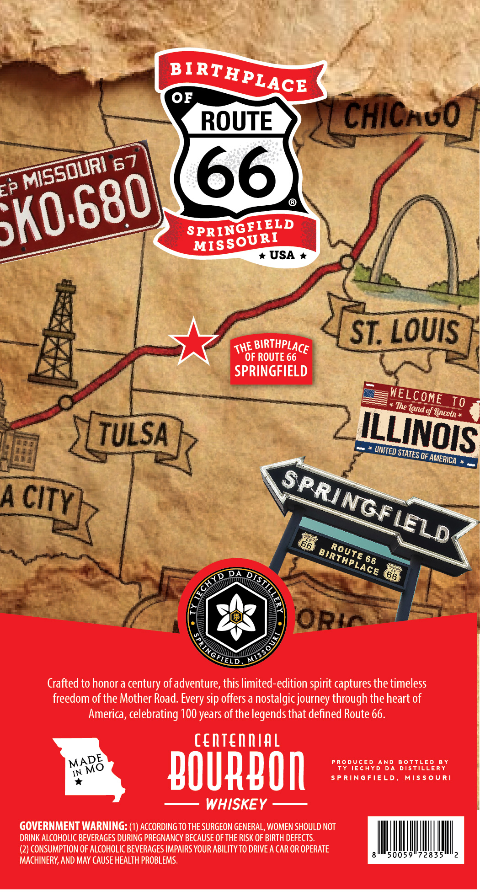
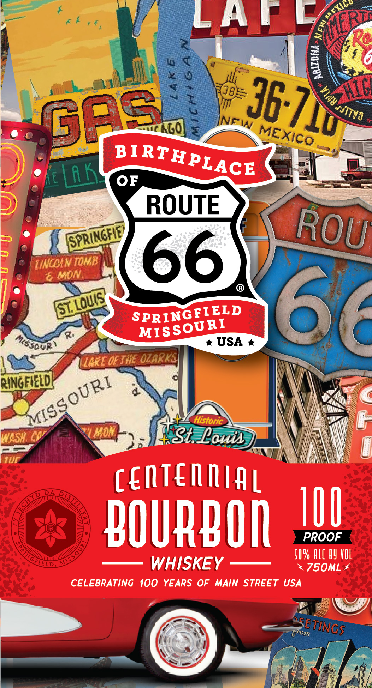

# TTB COLA Label Images - TTBID 26061001000751

**Brand Name:** CENTENNIAL BOURBON

**Fanciful Name:** BIRTHPLACE OF ROUTE 66

**Issue Date:** 03/09/2026

**Origin Code:** 29

**Product Class/Type:** 141

**Source:** [TTB Public COLA Registry](https://ttbonline.gov/colasonline/viewColaDetails.do?action=publicFormDisplay&ttbid=26061001000751)

## Label Images

### Back Label

### Front Label

## Extracted Label Text

*Text extracted via OCR - may contain errors*

### Back Label

OF
ROUTE
chichuo
EP
66
SPRINGETRLD
USA
ST. LOUIS
OF ROUTE 66
SPRINGFIELD
The
To
{ Jincoln
TULSA
united =
OF
A
66
66
DA
66
ORIc
Crafted to honor a century of adventure; this limited-edition spirit captures the timeless
freedom of the Mother Road:
sip offers a nostalgic journey through the heart of
America, celebrating 100 years of the legends that defined Route 66.
centenmtal
PRODUcED
AND
B OTTLED
B Y
NN Mo
bOURBOI
Ty IEChYD
DA
DISTILLERY
S PRINGFIELD
MIS50U R
WHISKEY
GOVERNMENT WARNING: (1) AcCORDING TO THE SURGEON GENERAL; WOMEN SHOULD NOT
DRINK ALCOHOLIC BEVERAGES DURING PREGNANCY BECAUSE OF THE RISK OF BIRTH DEFECTS.
(2) CONSUMPTION OF ALCOHOLIC BEVERAGES IMPAIRS YOUR ABILITY TO DRIVE A CAR OR OPERATE
50059"72835
MACHINERY; AND MAY CAUSE HEALTH PROBLEMS.
BIRTHPLACE
67
Missduri
5k0.6801
MISSOURI
BIRTHPLACE
THE
WELCOME
Yand o
ILLINOIS
STATES C
AMERICA
SPRINGFC
CITY
WELDS
RouTE
BirtmPLacE
HYD
5
MISSS
IELD
Every =
MADE

### Front Label

LAMC
:
0
Lu
OF
ROUTE
"tancin Tomb
66
Mon
GL
SPRINGERLD
66
USA
VaEde Ihe O2ArLA|
RINGE
MaSY
MoH
StLouin
centennial
bOURBOR
I8U
PROOF
5I % HLL By VIL
ELD
WHISKEY
750ML
CELEBRATING 100 YEARS OF
MAIN STREET USA
5E
Uom
Mcxico
NERu
0
8
hic
36 7
1
3
ga8
Jyitva
NFW
MEXicO
BIRTHPLACE
Lak
ROU
FPRINGELEY
Loue'
MISSOURI
Assotp'
QURI
MISS
Historic _
TINGS
