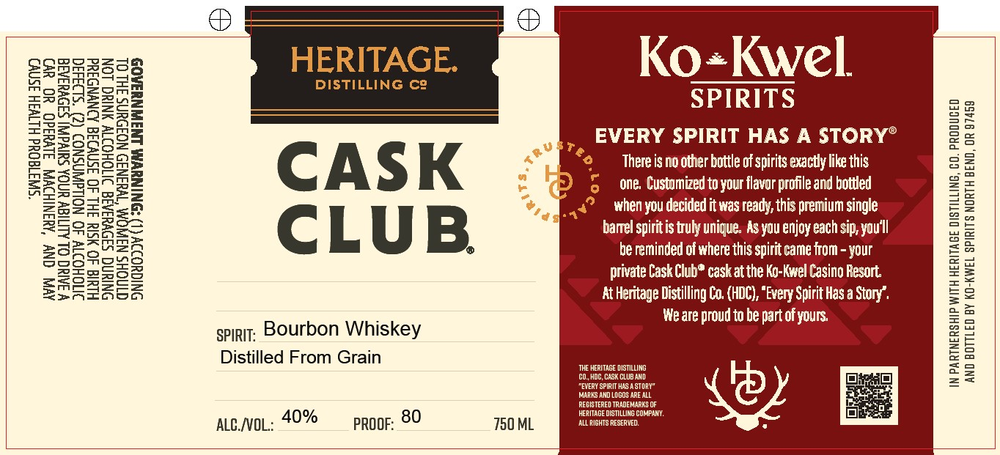

# TTB COLA Label Images - TTBID 26061001000852

**Brand Name:** HERITAGE DISTILLING CO. CASK CLUB

**Issue Date:** 03/04/2026

**Origin Code:** 38

**Product Class/Type:** 141

**Source:** [TTB Public COLA Registry](https://ttbonline.gov/colasonline/viewColaDetails.do?action=publicFormDisplay&ttbid=26061001000852)

## Label Images

### Label 1

## Extracted Label Text

*Text extracted via OCR - may contain errors*

### Label 1

SEzaA

Poetotal

HERITAGE.

Ko+Kwel.

SEs

Rog dzonm

aac

DISTILLING Ce

BPAareszue

SPIRITS

a3

aa

=o

aes

aS

Sse

os

3S

=m

Some og

mem

EVERY SPIRIT HAS A STORY°

es

Se

aa

Sriseeia

So

S32

6

Be

ReaSmee

ey

There is no other bottle of spirits exactly like this

am

=eeso

ss

Am

CASK

9°

one. Customized to your flavor profile and bottled

==

==

mass

pare

SS

4

4

ES

=o

=

oon

SeSzs

oo

=P

when you decided it was ready, this premium single

ae

Bona

Se

easy

barrel spiritis truly unique. As you enjoy each sip, yau'll

ge

mw

za

eon

> Ame

S48

CLUB.

be reminded of where this spirit came from - your

ES

oo

Suenoro

ES

es

BrwS

aScS

private Cask Club® cask at the Ko-Kwel Casino Resort.

Es

=

EmeEsSz

Ze Atoon

At Heritage Distilling Co. (HDC), “Every Spirit Has a Story”.

=o

We are proud to be part of yours.

Za

om

spirit; Bourbon Whiskey

Se

go

aa

=o

BE

Distilled From Grain

We HE

LNG

=a

Ea

mo

EVER

AND

ATOR

2=

aS

MARS AND

MEAL

Y)

ena

REGISTERED

IN COMPANY

MARKS OF

ae.voL: 40%

proor: 80

750 ML

ALL RIGHTS RESERV
