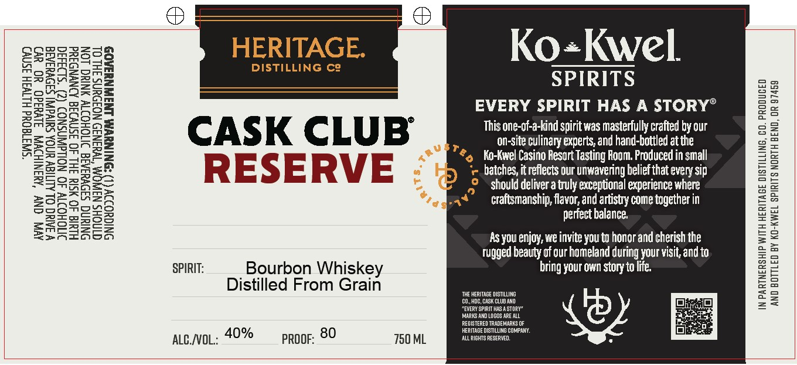

# TTB COLA Label Images - TTBID 26061001000877

**Brand Name:** HERITAGE DISTILLING CO. CASK CLUB RESERVE

**Issue Date:** 03/04/2026

**Origin Code:** 38

**Product Class/Type:** 141

**Source:** [TTB Public COLA Registry](https://ttbonline.gov/colasonline/viewColaDetails.do?action=publicFormDisplay&ttbid=26061001000877)

## Label Images

### Label 1

## Extracted Label Text

*Text extracted via OCR - may contain errors*

### Label 1

*SD343d

“SWA1d0Ud HLTV3H Isny)

AV ONY ‘RINIHDWA Jivdad0 YO wv)
AM TYHSINID NOFOUNS FHL OL
NINUWAK LNJWNUAA0S

NS

VAC OL ALITICY UNOA a ee
ONIGUOIIY

SMOHOITY 40 NOLLdAWNSNO>
HIUId 40 WSIY IHL 40 3SN¥IId AONYND Id

ONIN SIDVUIAIG ITIOHOITY ANIC LON

MINOHS Nai

DISTILLING Ce

CASK CLUB
RESERVE

SPIRIT: Bourbon Whiskey
Distilled From Grain

aucvoL: 40% progr; 80 750 ML

Ko+Kwel
SPIRITS

EVERY SPIRIT HAS A STORY®

This one-of-a-kind spirit was masterfully crafted by our
on-site culinary experts, and hand-bottled at the
4, Ko-Kwel Casino Resort Tasting Room. Produced in small
‘e batches, it reflects our unwavering belief that every sip
> Should deliver a truly exceptional experience where
craftsmanship, flavor, and artistry come tagether in
perfect balance,

As you enjoy, we invite you to honor and cherish the
Tugged beauty of our homeland during your visit, and to
bring your own story to life.

IN PARTNERSHIP WITH HERITAGE DISTILLING, CO. PRODUCED
AND BOTTLED BY KO-KWEL SPIRITS NORTH BEND, OR 97459
