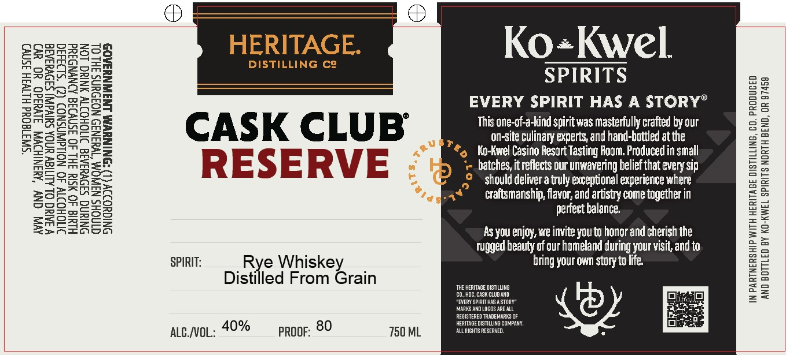

# TTB COLA Label Images - TTBID 26061001000882

**Brand Name:** HERITAGE DISTILLING CO. CASK CLUB RESERVE

**Issue Date:** 03/04/2026

**Origin Code:** 38

**Product Class/Type:** 142

**Source:** [TTB Public COLA Registry](https://ttbonline.gov/colasonline/viewColaDetails.do?action=publicFormDisplay&ttbid=26061001000882)

## Label Images

### Label 1

## Extracted Label Text

*Text extracted via OCR - may contain errors*

**Detected Proof:** 80

### Label 1

*$D343d

“SWA1d0Ud HLTV3H Isny)

AVA ONY ‘RIINIHDWA Jivdad0 YO_WvD

NINUWAR LNJWNUAA0S

AA TYHSINID NOFOUNS FHL OL

NS

HIUIa 40 YSIY IHL 40 JSN¥IId AONYND Id
ONIGUOIIY

ONIUNG SADVUIAIG ITIOHOITY ANIC LON

VIAN OL ALITICY UNOA a ee
MINOHS Nai

SMOHOITY 40 NOLLdAWNSNOD

DISTILLING C9

SPIRITS
EVERY SPIRIT HAS A STORY®

Cc A S$ K Cc LU B This one-of-a-kind spirit was masterfully crafted by our
. on-site culinary experts, and hand-bottled at the

4 Ko-Kwel Casino Resort Tasting Room. Produced in small

R E S E RV E ‘e batches, it reflects our unwavering belief that every sip

Should deliver a truly exceptional experience where
craftsmanship, flavor, and artistry come tagether in

perfect balance.
As you enjoy, we invite you to honor and cherish the
Tugged beauty of our homeland during your visit, and to
SPIRIT: Rye Whiskey bring your own story to life.
Distilled From Grain

IN PARTNERSHIP WITH HERITAGE DISTILLING, CO. PRODUCED
AND BOTTLED BY KO-KWEL SPIRITS NORTH BEND, OR 97459

aucwvoL: 40% proof: 80 750 ML
