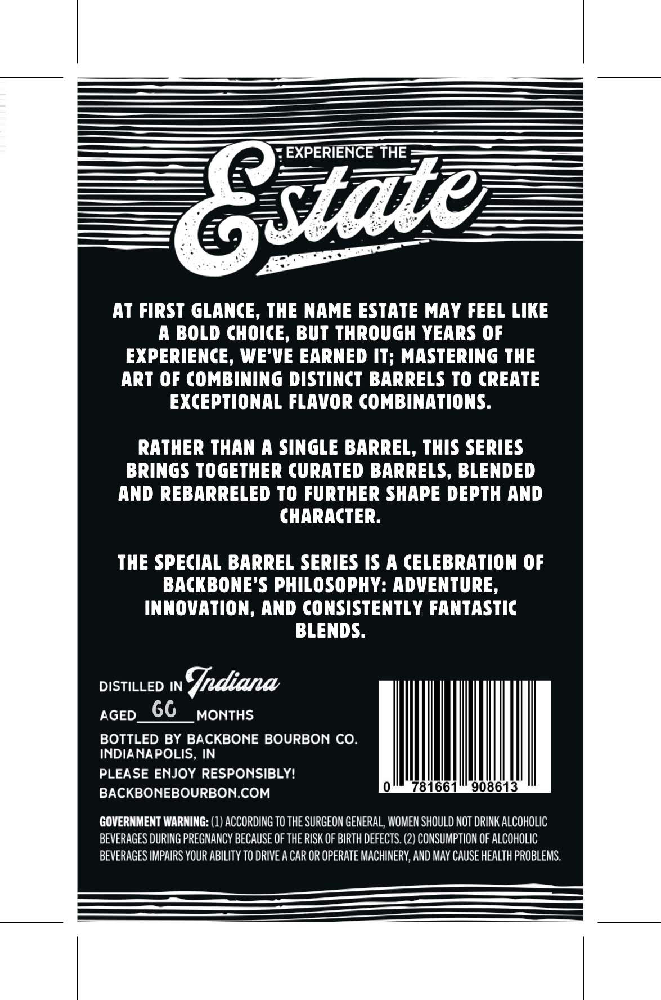
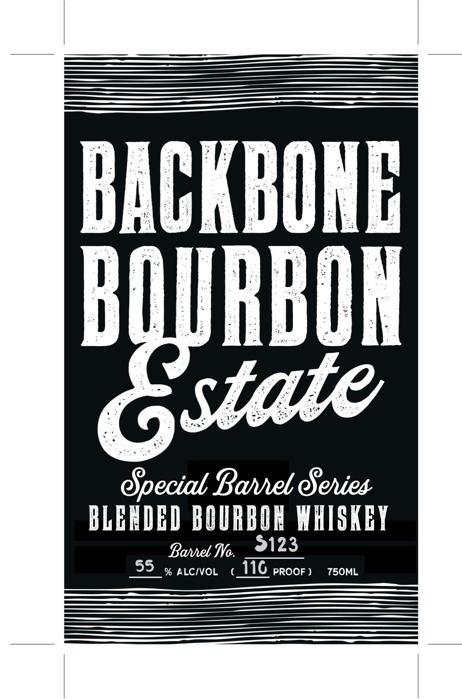

# TTB COLA Label Images - TTBID 26062001000047

**Brand Name:** BACKBONE BOURBON ESTATE

**Issue Date:** 03/11/2026

**Origin Code:** 19

**Product Class/Type:** 131

**Source:** [TTB Public COLA Registry](https://ttbonline.gov/colasonline/viewColaDetails.do?action=publicFormDisplay&ttbid=26062001000047)

## Label Images

### Back Label

### Front Label

## Extracted Label Text

*Text extracted via OCR - may contain errors*

**Detected Proof:** 110

### Back Label

EXPERIENCE THE
Gstate
At FiRST GLANCE, THE NAME ESTATE MAY FEEL LIKE
A BOLD CHOICE, BUT THROUGH YEARS OF
EXPERIENCE, WE'VE EARNED IT; MASTERING THE
ART OF COMBINING DISTINCT BARRELS TO CREATE
EXCEPTIONAL FLAVOR COMBINATIONS:
RATHER THAN A SINGLE BARREL, THIS SERIES
BRINGS TOGETHER (URATED BARRELS, BLENDED
AND REBARRELED TO FURTHER SHAPE DEPTH AND
CHARACTER:
THE SPECIAL BARREL SERIES /S A (ELEBRATION OF
BACKBONE'S PHILOSOPHY: ADVENTURE,
INNOVATION, AND CONSISTENTLY FANTASTIC
BLENDS:
DISTILLED IN
Fndiana
AGED
66
MONTHS
BOTTLED BY BACKBONE BOURBON CO
INDIANAPOLIS, IN
PLEASE ENJOY RESPONSIBLY!
BACKBONEBOURBON.COM
78166
908613
GOVERNMENT WARNING: (1) ACCORDING TO THE SURGEON GENERAL, WOMEN SHOULD NOT DRINK ALCOHOLIC
BEVERAGES DURING PREGNANCY BECAUSE OF THE RISK OF BIRTH DEFECTS. (2) CONSUMPTION OF ALCOHOLIC
BEVERAGES IMPAIRS YOUR ABILITy TO DRIVE A CAR OR OpeRATE MACHINERY, AND MAY CAUSE HEALTh PROBLEMS.

### Front Label

SS ———————E——————E———

SSE HESS

——————————

ACK

ING

HBON

Special Barrel Series

BLENDED BOURBOR WHISKEY

Barrel Wo.

123

55 % ALC/VOL ( 116 PROOF) 750ML
