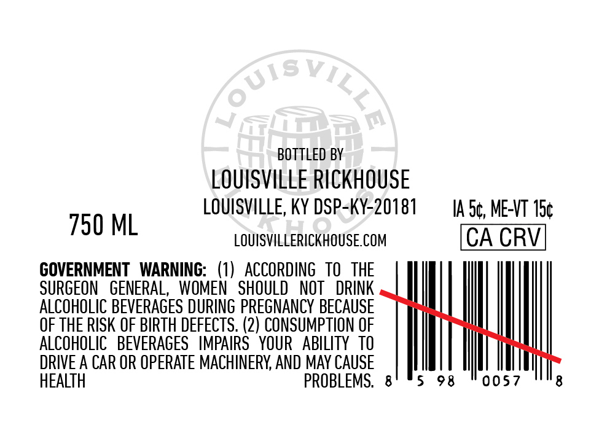
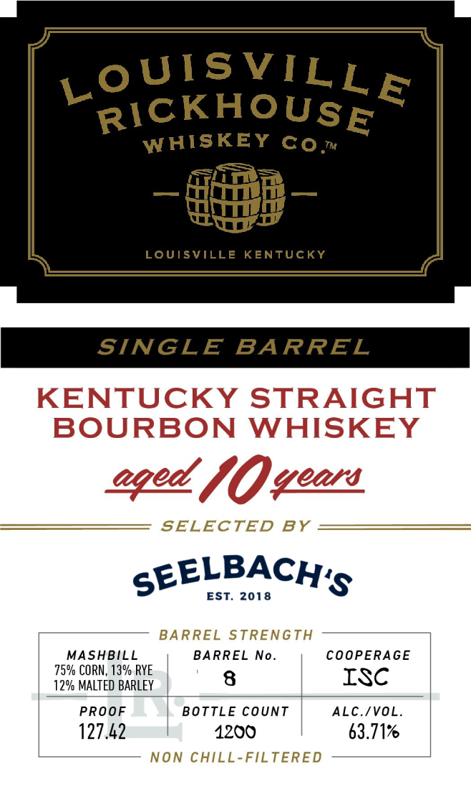

# TTB COLA Label Images - TTBID 26062001000217

**Brand Name:** LOUISVILLE RICKHOUSE WHISKEY CO

**Issue Date:** 03/05/2026

**Origin Code:** 22

**Product Class/Type:** 101

**Source:** [TTB Public COLA Registry](https://ttbonline.gov/colasonline/viewColaDetails.do?action=publicFormDisplay&ttbid=26062001000217)

## Label Images

### Back Label

### Label 1

## Extracted Label Text

*Text extracted via OCR - may contain errors*

### Back Label

BOTTLED BY
LOUISVILLE RICKHOUSE
LOUISVILLE, KY DSP-KY-20181

730 ML LOUISVILLERICKHOUSE.COM

GOVERNMENT WARNING: (1) ACCORDING TO THE
SURGEON GENERAL, WOMEN SHOULD NOT DRINK
ALCOHOLIC BEVERAGES DURING PREGNANCY BECAUSE
OF THE RISK OF BIRTH DEFECTS. (2) CONSUMPTION OF
ALCOHOLIC BEVERAGES IMPAIRS YOUR ABILITY TO
DRIVE A CAR OR OPERATE MACHINERY, AND MAY CAUSE
HEALTH PROBLEMS. 8

5

IA.S¢, ME-VT 15¢
CA CRV

98 "0057

8

### Label 1

LoUISVILLE
RICKHOUSE
WHISKEY
LoUISVILLE KENTUCKY
SINGLE
BARREL
KENTUCKY STRAIGHT
BOURBON WHISKEY
/0veon
SELECTED
BY
SEELBACH'S
EST. 2018
BARREL STRENGTH
MASHBILL
BARREL
No_
COOPERAGE
75% CORN, 139 RYE
12% MALTED BARLEY
8
ISC
PROOF
BOTTLE CounT
ALC.IVOL.
127.42
1200
63.717
Non CHILL-FILTERED
co
eqed ,
