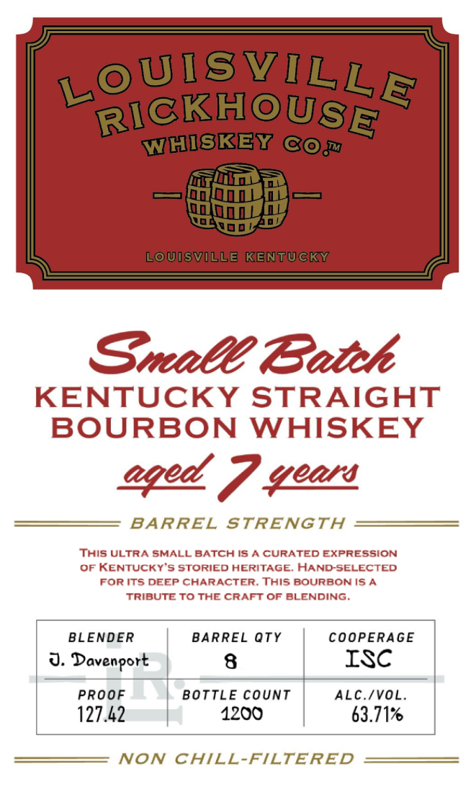

# TTB COLA Label Images - TTBID 26062001000226

**Brand Name:** LOUISVILLE RICKHOUSE WHISKEY CO

**Issue Date:** 03/05/2026

**Origin Code:** 22

**Product Class/Type:** 101

**Source:** [TTB Public COLA Registry](https://ttbonline.gov/colasonline/viewColaDetails.do?action=publicFormDisplay&ttbid=26062001000226)

## Label Images

### Back Label

### Label 1

## Extracted Label Text

*Text extracted via OCR - may contain errors*

### Back Label

BOTTLED BY
LOUISVILLE RICKHOUSE
LOUISVILLE, KY DSP-KY-20181

730 ML LOUISVILLERICKHOUSE.COM

GOVERNMENT WARNING: (1) ACCORDING TO THE
SURGEON GENERAL, WOMEN SHOULD NOT DRINK
ALCOHOLIC BEVERAGES DURING PREGNANCY BECAUSE
OF THE RISK OF BIRTH DEFECTS. (2) CONSUMPTION OF
ALCOHOLIC BEVERAGES IMPAIRS YOUR ABILITY TO
DRIVE A CAR OR OPERATE MACHINERY, AND MAY CAUSE
HEALTH PROBLEMS. 8

5

IA.S¢, ME-VT 15¢
CA CRV

98 "0057

8

### Label 1

LoUISvILLE
RICKHOUSE
WHISKEY 6@j
LoUIsVILLE KENTUCKY
Sral Batch
KENTUCKY STRAIGHT
BOURBON
WHISKEY
eqed 7 %eor
BARREL
STRENGTH
This ULTRA SMALL BATCH IS /
CURATED EXPRESSION
OF KENTUCKY'S STORIED HERITAGE; HAND-SELECTED
FoR Its DEEP CHARACTER. This BOURBONIS A
TRIBUTE TO THE CRAFT OF BLENDING.
BLENDER
BARREL QTY
COOPERAGE
J. Davenport
8
ISC
PROOF
BOTTLE count
ALC IVOL
127.42
1200
63.717
NON
CHILL-FILTERED
