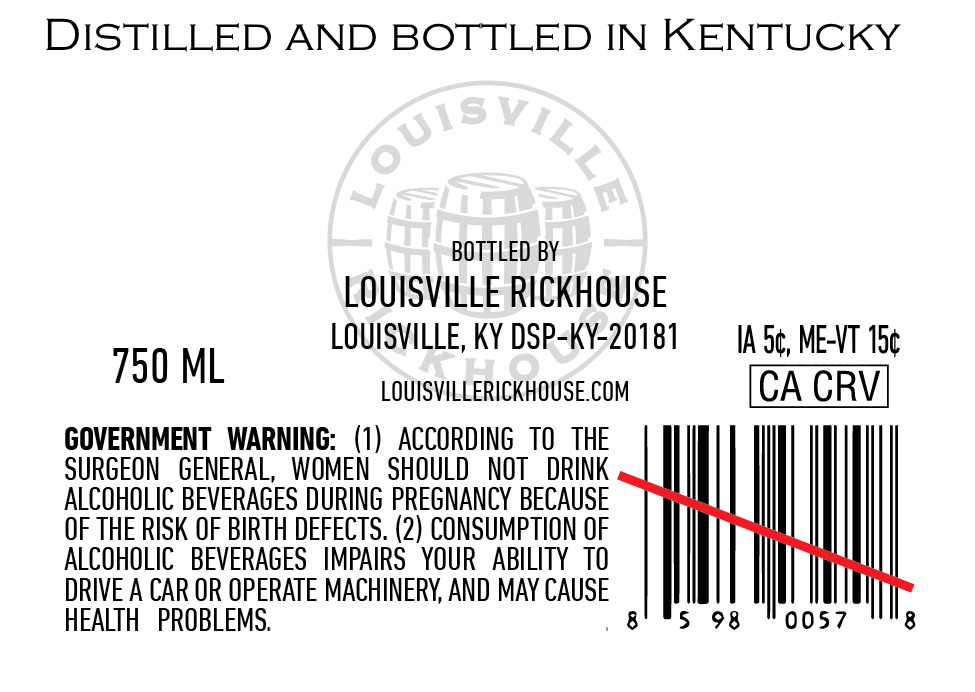

# TTB COLA Label Images - TTBID 26062001000227

**Brand Name:** LOUISVILLE RICKHOUSE WHISKEY CO

**Issue Date:** 03/06/2026

**Origin Code:** 22

**Product Class/Type:** 102

**Source:** [TTB Public COLA Registry](https://ttbonline.gov/colasonline/viewColaDetails.do?action=publicFormDisplay&ttbid=26062001000227)

## Label Images

### Back Label

### Front Label

## Extracted Label Text

*Text extracted via OCR - may contain errors*

**Detected Proof:** 127.4

### Back Label

DISTILLED AND BOTTLED IN KENTUCKY

BOTTLED BY

LOUISVILLE RICKHOUSE

LOUISVILLE, KY DSP-KY-20181

IA.S¢, ME-VT 15¢

750 ML

LOUISVILLERICKHOUSE.COM

CA CRV

GOVERNMENT WARNING: (1) ACCORDING TO THE

SURGEON GENERAL, WOMEN SHOULD NOT DRINK

ALCOHOLIC BEVERAGES DURING PREGNANCY BECAUSE

OF THE RISK OF BIRTH DEFECTS. (2) CONSUMPTION OF

ALCOHOLIC BEVERAGES IMPAIRS YOUR ABILITY TO

DRIVE A CAR OR OPERATE MACHINERY, AND MAY CAUSE

HEALTH PROBLEMS.

8

5 98

0057

8

### Front Label

LoUISVILCE
RICKHOUSE
WHISKEY
LoUsVILLE KENTUCKY
Srale Tatch
STRAIGHT
RYE
WHISKEY
7 gear
BARREL
STRENGTH
ThIS ULTRA-SMALL BATCH CURATED As
A DEFINITIVE
EXPRESSION OF KENTUCKY 'S SPICY HERITAGE:
HAND-SELECTED FOR ITS BOLD CHARACTER AND REFINED
FINISH, THIS RYE IS A TRIBUTE TO THE ART OF THE
LOUISVILLE RICKHOUSE.
BLENDER
BARREL QTY
COOPERAGE
J Davenport
4
ISC
PROOF
BOTTLE CoUnT
ALC./VOL_
127.42
60o
63.71%
NON
CHILL-FILTERED
CoJ
eqed
