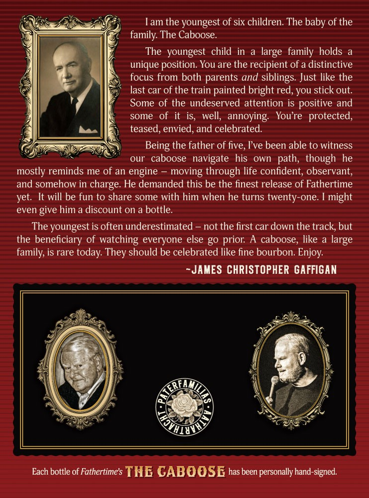
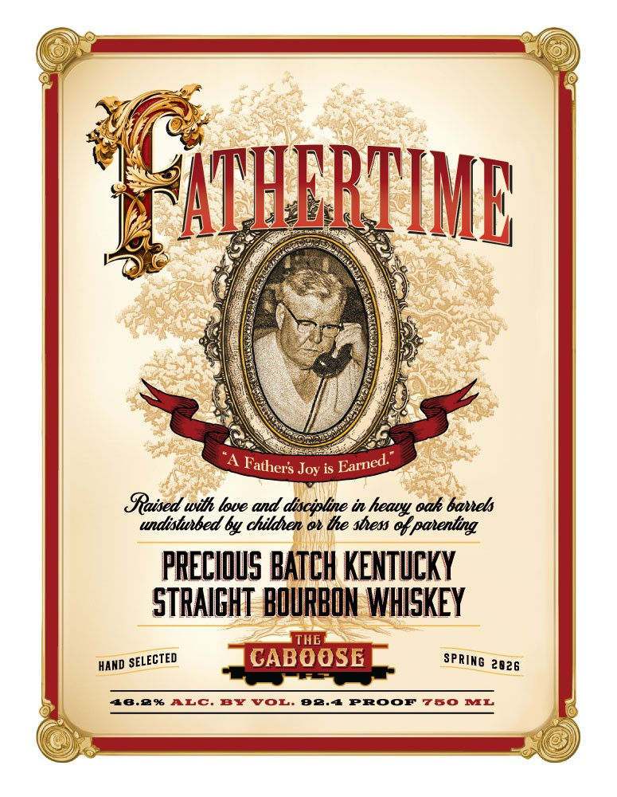
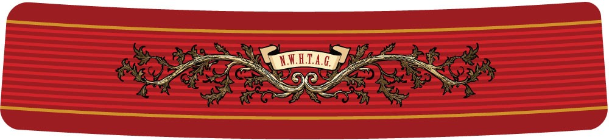
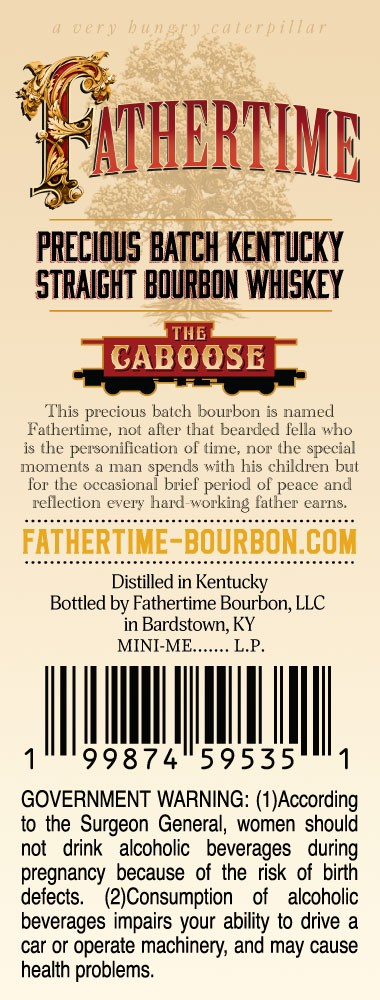

# TTB COLA Label Images - TTBID 26062001000230

**Brand Name:** FATHERTIME

**Issue Date:** 03/04/2026

**Origin Code:** 22

**Product Class/Type:** 101

**Source:** [TTB Public COLA Registry](https://ttbonline.gov/colasonline/viewColaDetails.do?action=publicFormDisplay&ttbid=26062001000230)

## Label Images

### Back Label

### Front Label

### Label 2

### Label 4

## Extracted Label Text

*Text extracted via OCR - may contain errors*

*1 image(s) excluded: text did not meet readability threshold*

**Detected Proof:** 81.6

### Back Label

Tam the youngest of six children: The baby of the
family The Caboose
The youngest child in
large  family holds
unique position. You are the recipient of a distinctive
focus from both parents and siblings: Just like the
last car of the train painted bright red, you stick out
Some of the undeserved attention is positive and
some of it is,
well,   annoying:
Youre   protected,
teased, envied, and celebrated:
the father of five, Tve been able to witness
our
caboose   navigate  his   own   path; though he
mostly reminds me of an engine
through life confident; observant
and somehow in charge. He demanded this be the finest release of Fathertime
It will be fun to share some with him when he turns twenty-one:
might
even give him a discount on a bottle:
The youngest is often underestimated
not the first car down the track; but
the beneficiary of watching everyone else go prior: A caboose; like
large
family, is rare
They should be celebrated like fine bourbon
JAMES CHRISTOPHER GAFFIGAN
Each bottle of Fathertimes THE CABOOSE has been personally hand-signed
Being
moving
yet
Enjoy:
today:

### Front Label

KHERTIMB
Staised uih bove and discipline in
oak baels
undistbed by childen o1 the sbess %} patenting
PRECIQUS BATCH KENTUCKY
STRAIGHT BOURBON WHISKEY
TIg
HAND
CABOOSE
2026
40.8%
ALC.
2>
VOL:
08.4
PROOr
760
ML
Earned:
Fathers
Joy
heavy
SELECTED
Spring

### Label 4

PS i; cn
oC kat oe
a
i § aes
mo
PRECIOUS BATCH KENTUCKY
STRAIGHT BOURBON WHISKEY
Sr
rattles
CABOOSE
This precious batch bourbon is named
Fathertime, not after that bearded fella who
is the personification of time, nor the special
moments a man spends with his children but
for the occasional brief period of peace and
reflection every hard-working father earns,
FATHERTIME-BOURBON.COM
Distilled in Kentucky
Bottled by Fathertime Bourbon, LLC
in Bardstown, KY
MINI-ME....... L.P.
1 INO
GOVERNMENT WARNING: (1)According
to the Surgeon General, women should
not drink alcoholic beverages during
pregnancy because of the risk of birth
defects. (2)Consumption of alcoholic
beverages impairs your ability to drive a
car or operate machinery, and may cause
health problems.
