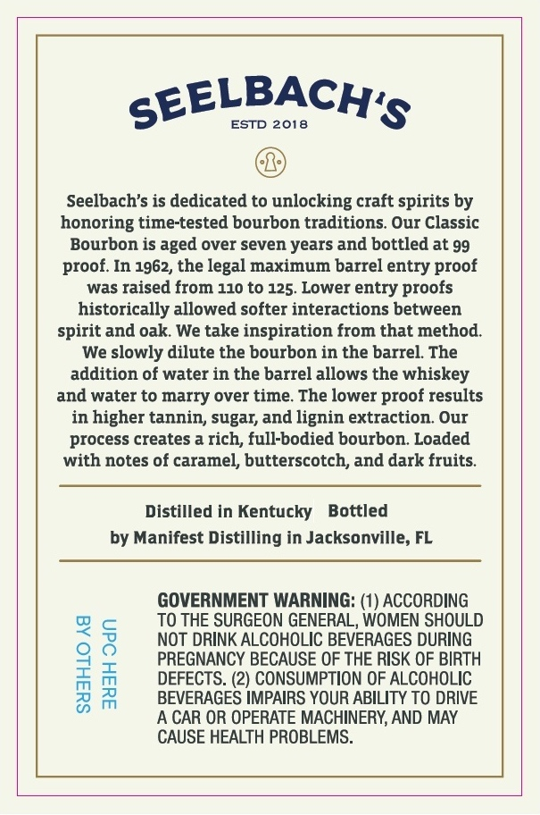
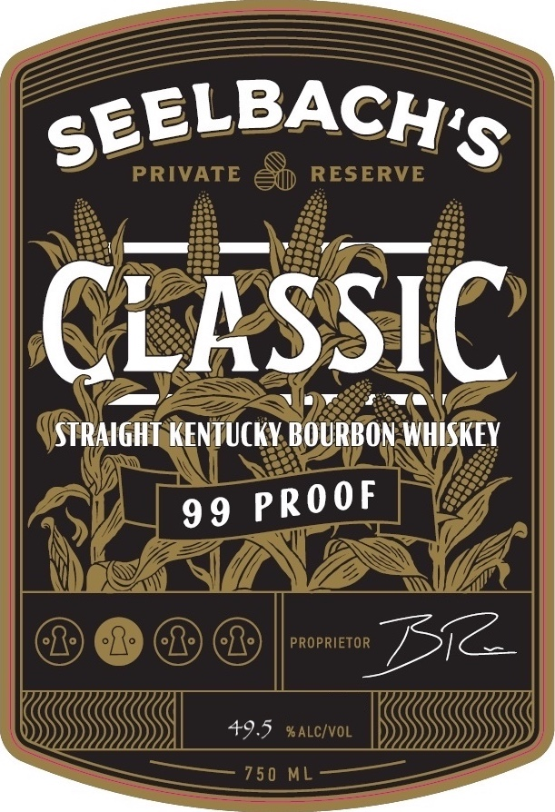

# TTB COLA Label Images - TTBID 26062001000236

**Brand Name:** SEELBACH'S

**Fanciful Name:** CLASSIC

**Issue Date:** 03/04/2026

**Origin Code:** 16

**Product Class/Type:** 101

**Source:** [TTB Public COLA Registry](https://ttbonline.gov/colasonline/viewColaDetails.do?action=publicFormDisplay&ttbid=26062001000236)

## Label Images

### Back Label

### Front Label

## Extracted Label Text

*Text extracted via OCR - may contain errors*

**Detected Proof:** 99

### Back Label

SEELBACH'S
ESTD 2018
Seelbach's is dedicated to unlocking craft spirits by
honoring time-tested bourbon traditions Our Classic
Bourbon is aged over seven years and bottled at 99
In 1962, the legal maximum barrel
proof
was raised from 110 tO 125. Lower entry proofs
historically allowed softer interactions between
spirit and oak We take inspiration from that method:
We slowly dilute the bourbon in the barrel  The
addition of water in the barrel allows the whiskey
and water to marry over time: The lower proof results
in higher tannin, sugar; and lignin extraction. Our
process creates a rich, full-bodied bourbon. Loaded
with notes of caramel, butterscotch, and dark fruits
Distilled in Kentucky
Bottled
by Manifest Distilling in Jacksonville, FL
GOVERNMENT WARNING: (1) ACCORDING
To
SURGEON GENERAL, WOMEN SHOULD
NOT DRINK ALCOHOLIC BEVERAGES DURING
88
DEFGCFSC? BEGASSE PFIOHEFISKCOFOIRCH
BEVERAGES IMPAIRS YOUR ABILITY TO DRIVE
A CAR OR OPERATE MACHINERY; AND MAY
CAUSE HEALTH PROBLEMS.
proof:
entry
THE

### Front Label

SEELBACH'S
PRIVATE
RESERVE
CLASSIC
UstraIghT KENTUCKV BOURBON WHISKEY
99
PROPRIETOR
Bi
49.5 %ALC/VOL
750 ML
PRooF
