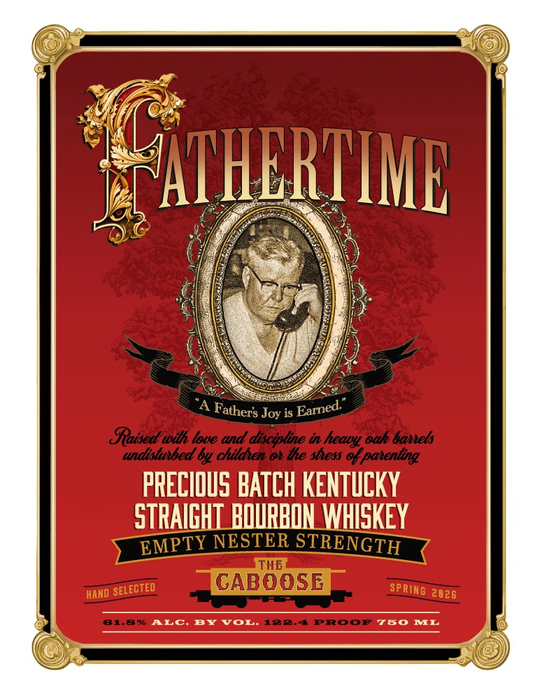
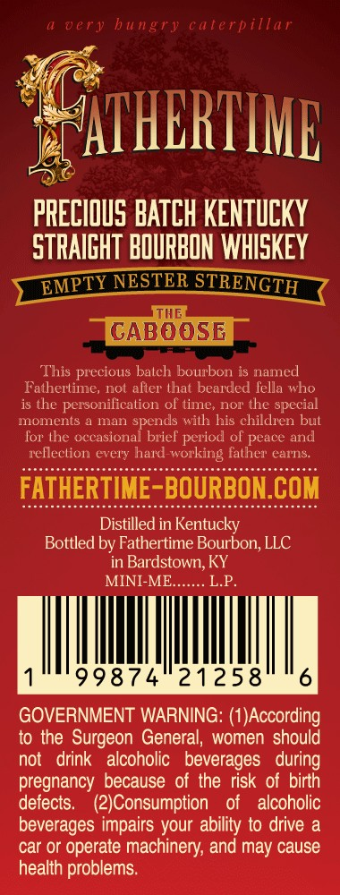
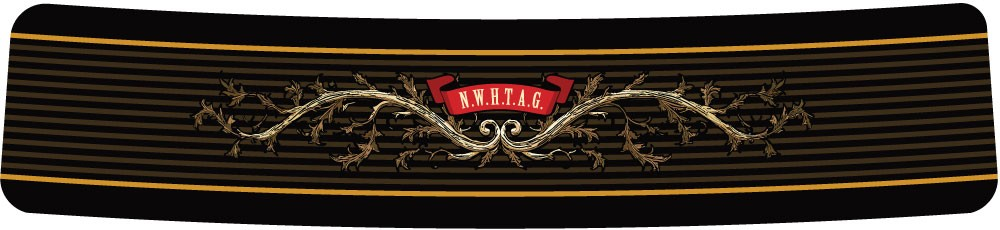

# TTB COLA Label Images - TTBID 26062001000246

**Brand Name:** FATHERTIME

**Issue Date:** 03/04/2026

**Origin Code:** 22

**Product Class/Type:** 101

**Source:** [TTB Public COLA Registry](https://ttbonline.gov/colasonline/viewColaDetails.do?action=publicFormDisplay&ttbid=26062001000246)

## Label Images

### Back Label

### Front Label

### Label 3

### Label 4

## Extracted Label Text

*Text extracted via OCR - may contain errors*

*1 image(s) excluded: text did not meet readability threshold*

**Detected Proof:** 81.8

### Back Label

Tam the youngest of six children: The baby of the
family The Caboose
The youngest child in
large  family holds
unique position. You are the recipient of a distinctive
focus from both parents and siblings: Just like the
last car of the train painted bright red, you stick out
Some of the undeserved attention is positive and
some of it is,
well,   annoying:
Youre   protected,
teased, envied, and celebrated:
the father of five, Tve been able to witness
our
caboose   navigate  his   own   path; though he
mostly reminds me of an engine
through life confident; observant
and somehow in charge. He demanded this be the finest release of Fathertime
It will be fun to share some with him when he turns twenty-one:
might
even give him a discount on a bottle:
The youngest is often underestimated
not the first car down the track; but
the beneficiary of watching everyone else go prior: A caboose; like
large
family, is rare
They should be celebrated like fine bourbon
JAMES CHRISTOPHER GAFFIGAN
Each bottle of Fathertimes THE CABOOSE has been personally hand-signed
Being
moving
yet
Enjoy:
today:

### Front Label

EYATHERIIMB
Joy is
Staised wilh loue and disciplne in
oak bavels
undisttbed 64 childhen o ihe sbess %f patenting
PRECIOuS BATCH KENTUCKY
STRAIGHI BOURBON WHISKEY
NESTER STRENGTH
TIE
GABOOSE
HAND
2026
81.8%
ALC
BY
JoL'
1884
PRoor
780
IVL
Earned:
Fathers
heauy
EMPTY
SELECTED
~SpRING

### Label 3

very bungry caterpillar
XATHERIIML
PRECIOUS BATCH KENTuCKY
STRAIGHT BOURBON WhISKEY
EMPTY NESTER STRENGTH
THE
GABOOSE
This precious batch bourbon is named
Fathertime_
not alter that bearded Tella who
is the personilication ol time_
nor the
special
mOmenS
man spends wilh his children bul
Tor tne
Decasiona
brief
ol peace and
reflection every hard
father earns.
FATHERTIME-BOURBON.COM
Distilled in Kentucky
Bottled by Fathertime Bourbon; LLC
in Bardstown KY
MINI-ME.
LP_
99874
21258
6
GOVERNMENT WARNING: (1JAccording
to the Surgeon General, women should
not
drink
alcoholic   beverages
during
pregnancy because of the risk of birth
detects:
(2JConsumption
of
alcoholic
beverages impairs your ability t0 drive a
car or operate machinery; and may cause
health problems
period
working
