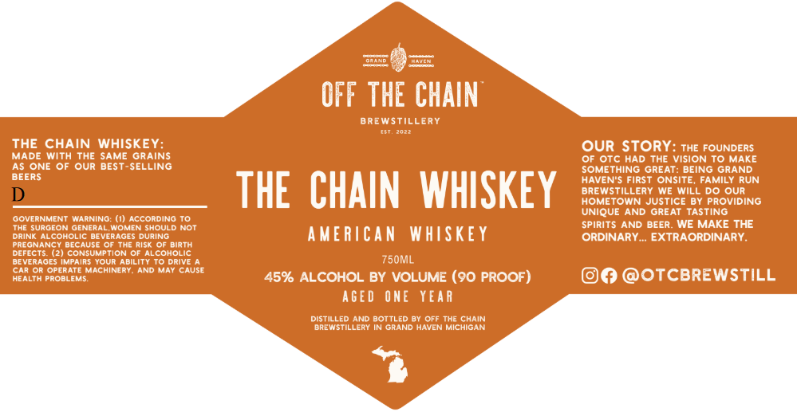

# TTB COLA Label Images - TTBID 26062001000253

**Brand Name:** OFF THE CHAIN

**Fanciful Name:** THE CHAIN WHISKEY

**Issue Date:** 03/04/2026

**Origin Code:** 06

**Product Class/Type:** 140

**Source:** [TTB Public COLA Registry](https://ttbonline.gov/colasonline/viewColaDetails.do?action=publicFormDisplay&ttbid=26062001000253)

## Label Images

### Label 1

## Extracted Label Text

*Text extracted via OCR - may contain errors*

**Detected Proof:** 90

### Label 1

OIcDD
I
OFF THE CHAIN
BREWSTIL
ERY
THE CHAIN WHISKEY:
OUR STORY
THE FOUNDERS
MADE With THE
SAME GRAINS
OF OTc HAD
THE
VISION To MAKE
AS ONE OF
OUr BEST-SELLING
SOMETHING GREAT: BEING GRAND
BEERS
HAVEN"S First ONSITE; FAMILY RUN
D
THE   CHAIN  WHISKEY
HOEWESOWERJUSTICVIDY PROQUINg
UNIQUE AND
GREAT TASTING
GOVERNMENT WNARNING: (I) ACCOrDINg
The surgeon GENBRAL
WOMEN SHOULD Not
Spirits AND BEER
WE MAKE THE
DRINK Alcoholic BEVERAGES DURING
AmERiCAN
WHSKE Y
ORDINARY  EXTRAORDINARY
PREGNANCY
91causi
THE RISk
birTH
DEFEcTS:
Consumption 0
AlcohOLIc
DEVeRAGES ImpaIRS Your AbilItY To DRIVE
750ML
Car Or Operate
Lsdu
ANd
May Cause
HEALTH PRoBLEMS:
45% ALCOHOL BY VOLUME (90 PROOF)
@OTCBREWSTILL
AGED
ONE
YEAR
Distilled AND BottLED By Off The CHAIN
brewstilLeRY IN GRAND HAVEN MIchigAn
