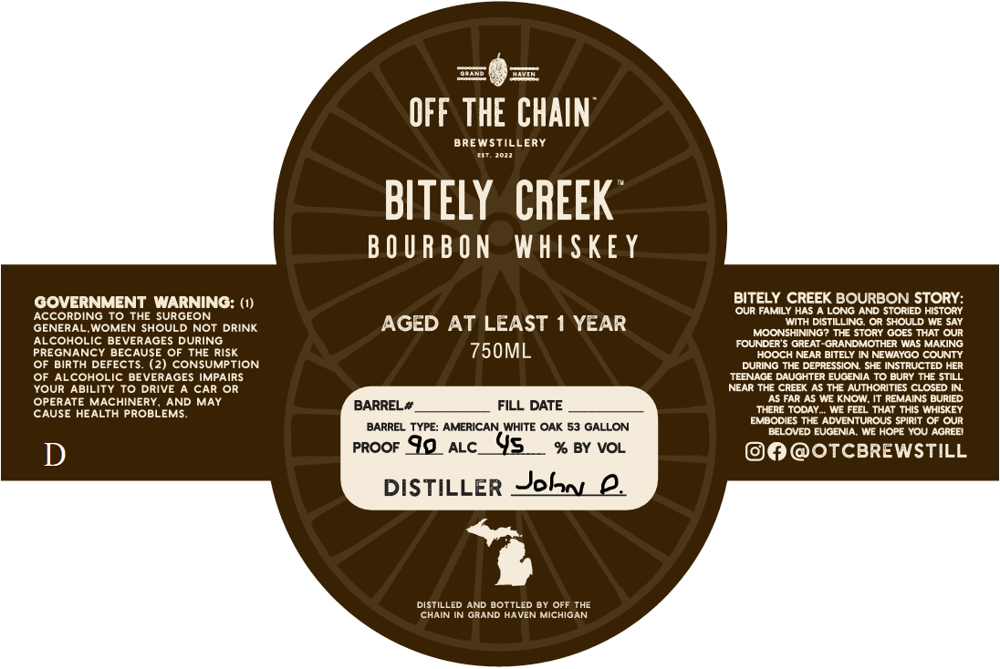

# TTB COLA Label Images - TTBID 26062001000258

**Brand Name:** BITLEY CREEK

**Issue Date:** 03/05/2026

**Origin Code:** 06

**Product Class/Type:** 141

**Source:** [TTB Public COLA Registry](https://ttbonline.gov/colasonline/viewColaDetails.do?action=publicFormDisplay&ttbid=26062001000258)

## Label Images

### Label 1

## Extracted Label Text

*Text extracted via OCR - may contain errors*

### Label 1

OFF THE CHAIN"
BRE WSTILLERY
BITELY   CREEK
B 0 U R B O N
WHISkE Y
GOVERNMENT WARNING: (1)
BITELY CREEK BOURBON STORY=
Our FAMILY HAS
LONG AND STORIED HISTORY
ACCORDING To THE SURGEON
AGED AT LEAST
YEAR
With DISTILLING OR SHOULD WE SaY
GENERAL WOMEN SHOULD NOT DRINK
MOONSHINING? THE STOry GOES THAT OUR
ALcOHOLIC BEVERAGES DURING
FOUNDER'$ GREAT-GRANDMOTHER WAS MAKING
PREGNANCY BECAUSE OF THE RISK
750ML
HOOCH NEAR BITELY IN NEWAYGO COUNTY
OF BIRTH DEFECTS_
(2) CONSUMPTION
DURING THE DEPRESSION SHE INSTRUCTED HER
OF ALcOHOLIC BEVERAGES IMPAIRS
TEENACE DAUGHTER EUCENIA TO Bury ThE StILL
YOUR ABILITY To DRIVE A CAR OR
NEAR The CrEEK As The AUTHORITIES CLOSED IN
OPERATE MACHINERY
AND MAY
BARREL#
FILL DATE
As FAR As WE KNOW; It REMAINS BURIED
CAUSE HEALTH PROBLEMS
THERE TODAY
WE FEEL THAT THIs WHISKEY
EMBODIES THE ADVENTUROUS SpIRIT OF OUR
BARREL TYPE: AMERICAN WHITE OAK 53 GALLON
BELOVED EUGENIA. WE HOPE YOU AGREEI
D
PROOF 9o
ALC
45
% BY VOL
OTCBREWSTILL
DISTILLER Jeh
DISTILLed AND BOTTLED BY OFF THE
CHAIN IN GRAND HAVEN MICHIGAN
