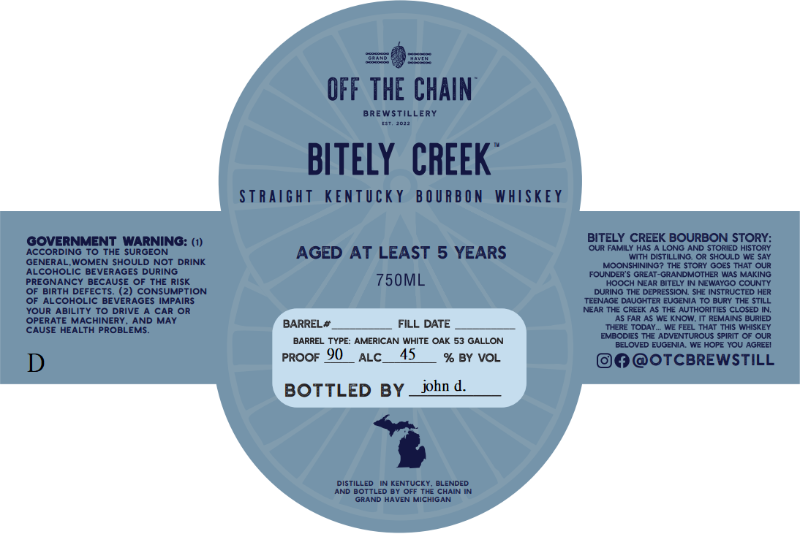

# TTB COLA Label Images - TTBID 26062001000262

**Brand Name:** BITLEY CREEK

**Issue Date:** 03/05/2026

**Origin Code:** 06

**Product Class/Type:** 101

**Source:** [TTB Public COLA Registry](https://ttbonline.gov/colasonline/viewColaDetails.do?action=publicFormDisplay&ttbid=26062001000262)

## Label Images

### Label 1

## Extracted Label Text

*Text extracted via OCR - may contain errors*

**Detected Proof:** 90
**Detected Age:** 5 Years

### Label 1

INE
OFF THE CHAIN
BREWSTILLERY
BITELY CREEK
SiRaight
KEnTUcky
B 0 U RB ON
WHISkEy
GOVERNMENT_WARNING: (1)
BITELY CREEK BOURBON STORY:
ACCORDING TO THE SURGEON
AGED
AT LEAST
5 YEARS
OUR FAMILY HAS
LONG AND STORIED HISTORY
WITH DISTILLING. OR SHOULD WE SAY
GENERAL.WOMEN SHOULD NOT
DRINK
MOONSHINING? THE STORY GOES THAT OUR
ALCOHOLIC BEVERAGES DURING
FOUNDER'$ GREAT-GRANDMOTHER WAS MAKING
PREGNANCY BECAUSE OF THE RISK
750ML
HOOCH NEAR BITELY IN NEWAYGO COUNTY
OF Birth DEFECTS:
CONSUMPTION
DURING THE DEPRESSION SHE INSTRUCTED HER
OF ALCOHOLIC BEVERAGES IMPAIRS
TEENAGE DAUGHTER EUGENIA TO BURY THE STILL
YOUR ABILITY To DRIVE
CAR
NEAR The CREEK AS THE AUTHORITIES CLOSED IN:
OPERATE MACHINERY ,
AND MAY
DATE
AS FAR AS We KNOW; IT REMAINS BURIED
CAUSE HEALTH PROBLEMS
BARREL#
FILL
TherE TODAY
We FEZL THAT ThIs WHISKEY
EMBODIES THE ADVENTUROUS SPIRIT Of OUR
BARREL TYPE: AMERICAN WHITE OAK 53 GALLON
BELOVED EUGENIA
We HOPE YOU AGREEI
D
PROOF 90
ALC_
45
% BY VOL
OTCBREWSTILL
BOTTLED BY
john d.
DISTILLED
KENTUCKY. BLENDED
AND BOTTLED BY OFF The CHAIN IN
GRAND HAVEN MICHIGAN
