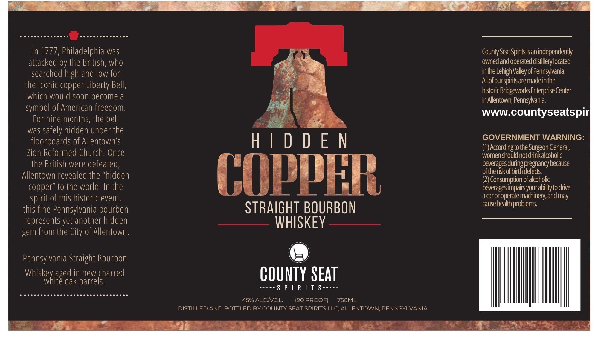

# TTB COLA Label Images - TTBID 26062001000272

**Brand Name:** HIDDEN COPPER

**Issue Date:** 03/13/2026

**Origin Code:** 39

**Product Class/Type:** 101

**Source:** [TTB Public COLA Registry](https://ttbonline.gov/colasonline/viewColaDetails.do?action=publicFormDisplay&ttbid=26062001000272)

## Label Images

### Label 1

## Extracted Label Text

*Text extracted via OCR - may contain errors*

**Detected Proof:** 90

### Label 1

3,’

ee eneceecceeces

ee Ww

n 1777, Philadelphia was

ry

County Seat Spirits is an independently

attacked by the British, who

owned and operated distillery located

inthe Lehigh Valley of Pennsylvania.

searched high and low fo

the iconic copper Liberty Bell,

Alofourspirits are madein the

which would soon become a

historic Bridgeworks Enterprise Center

in Allentown, Pennsylvania.

symbol of American freedo

www.countyseatspir

For nine months, the be

was safely hidden under the

floorboards of Allentown's

GOVERNMENT WARNING:

HIDDEN

(1) According to the Sur

on General,

Zion Reformed Church. Once

women should not drink alcoholic

i

the British were defeated,

beverages during pregnancy because

of the risk of birth defects.

Allentow

evealed the “hidde

(2) Consumption of alcoholic

copper” to the world. In the

beverages impairs your ability to drive

COPPER

a car or operate machinery, and may

spirit of this historic event,

cause health problems.

this fine Pennsylvania bourbo

STRAIGHT BOURBON

represents yet another hidde

——— WHISKEY ————

gem from the City of Allentow

Pennsylvania Straight Bourbo

Whiske

W

h

ite oak barrels.

aged in new charred

COUNTY SEAT

some PI RIT S

Serre ee

5% ALC/VOL.

(90 PROOF)

7SOML

DISTILLED AND BOTTLED BY COUNTY SEAT SPIRITS LLC, ALLENTOWN, PENNSYLVANIA

ae

Sa ae

eRe

a

Ae

ae ie” 2ST
