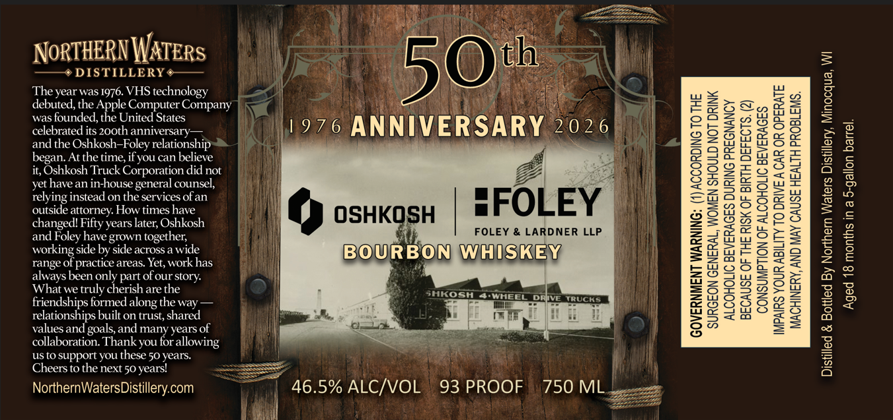

# TTB COLA Label Images - TTBID 26062001000330

**Brand Name:** 50TH ANNIVERSARY

**Issue Date:** 03/05/2026

**Origin Code:** 48

**Product Class/Type:** 141

**Source:** [TTB Public COLA Registry](https://ttbonline.gov/colasonline/viewColaDetails.do?action=publicFormDisplay&ttbid=26062001000330)

## Label Images

### Label 1

## Extracted Label Text

*Text extracted via OCR - may contain errors*

**Detected Proof:** 93
**Detected Age:** 50 Years

### Label 1

ALTE

hy

NorTHERN WATERS

th

——+ DISTILLERY #——

OF

The year was 1976. VHS technology

debuted, the Apple Computer Company

& Vig

Xan

was founded, the United States

celebrated its 200th anniversary—

1976 ANNIVE

and the Oshkosh-Foley relationshijy

RSARY 0076|

began. At the time, if you can believe

it, Oshkosh Truck Corporation did not

Z

BA |

i)

yet have an in-house general counsel,

i

— =

relying instead on the services of an

i\\

Hi

Soa

outside attorney. How times have

i)

sFOLEY

Bg

changed! Fifty years later, Oshkosh

Z2=

gS

9 OSHKO

FOLEY & LARDNER LLP

a

and Foley have grown together,

working side by side across a wide

}}

range of practice areas. Yet, work has

BOUBEION WHISKEY

if

6a

always been only part of our story.

Zo

aS

What we truly cherish are the

SHKOSH 4-WHEEL

Zu

=s

friendships formed along the way —

1

eo

relationships built on trust, shared

oir,

i)

ua oe

values and goals, and many years of

oe

oa

—

collaboration. Thank you for allowing

us to support you these 50 years.

=

Cheers to the next 50 years!

NorthernWatersDistillery.com

T 46.5% ALC/VOL 93 PROOF 750 ML

ee

Be

]
