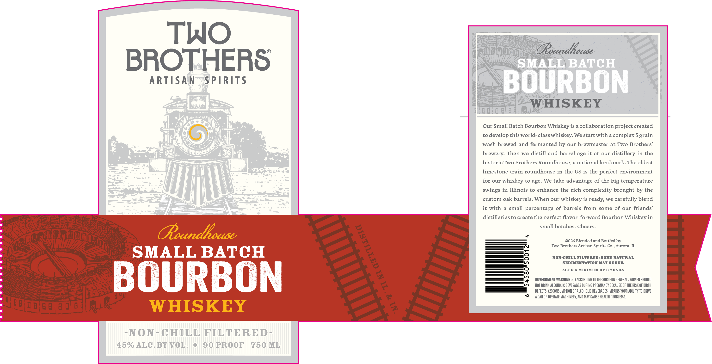

# TTB COLA Label Images - TTBID 26062001000389

**Brand Name:** TWO BROTHERS ARTISAN SPIRITS COMPANY

**Fanciful Name:** ROUNDHOUSE SMALL BATCH BOURBON

**Issue Date:** 03/05/2026

**Origin Code:** 04

**Product Class/Type:** 141

**Source:** [TTB Public COLA Registry](https://ttbonline.gov/colasonline/viewColaDetails.do?action=publicFormDisplay&ttbid=26062001000389)

## Label Images

### Label 1

## Extracted Label Text

*Text extracted via OCR - may contain errors*

**Detected Proof:** 90
**Detected Age:** 3 Years

### Label 1

TWO
Ooundhouse
BROTHERS
SMAEL BATCH
ARTISAN
SPIRITS
BOURBON
WHISKEY
Our Small Batch Bourbon Whiskey is a collaboration project created
to
develop this world-class whiskey: We startwith a complex 5
wash brewed and fermented by our brewmaster at Two Brothers'
brewery: Then we distill and barrel age it at our distillery in the
historic Two Brothers Roundhouse, a national landmark. The oldest
limestone train roundhouse in the US is the perfect environment
for
our
whiskey to age. We take advantage of the big temperature
swings in Illinois to enhance the rich complexity brought by the
custom oak barrels. When our
whiskey is ready, we carefully blend
it with
a small percentage of barrels
some of our friends'
distilleries to create the perfect flavor-forward Bourbon Whiskeyin
small batches. Cheers.
(Roundhouse
0026 Blended and Bottled by
Two Brothers Artisan Spirits
Aurora
SMALL BATCH
NON-CBILL FILTERED: SOHE NATURAL
SEDINENTATION MAY OCCUR
AGED
MINIMUM OF 3 YEARS
BOURBON
GOVERNMENT MARNING: (0) ACCORDING TO THE SURGEON GENERAL, WOMEN SHOULD
NOT DRINK ALCOHOLIC BEVERAGES DURING PREGNANCY BECAUSE OF ThE RISK OF BIRTH
DEFECTS. (2)CONSUMPTION OF ALCOHOLIC BEVERAGES IMPAIRS YOUR ABILITy TO DRIVE
(2
a CAR OR OpeRaTe MACHINERY; AND May Cause healTh PROBLEMS.
WHISKEY
1
~NON
CHILL FILTERED
45% ALC. BY VOL
90 PROOF
750 ML
grain
from
1
Co-,
