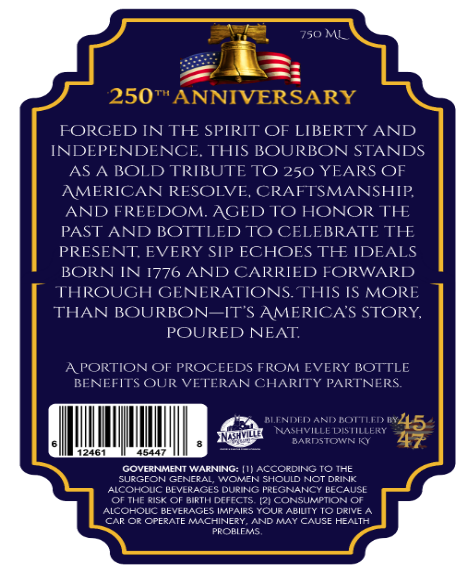
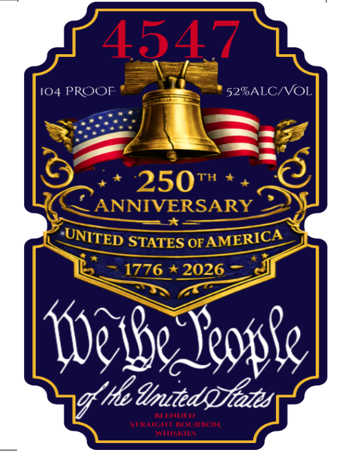

# TTB COLA Label Images - TTBID 26062001000417

**Brand Name:** 4547

**Issue Date:** 03/11/2026

**Origin Code:** 22

**Product Class/Type:** 129

**Source:** [TTB Public COLA Registry](https://ttbonline.gov/colasonline/viewColaDetails.do?action=publicFormDisplay&ttbid=26062001000417)

## Label Images

### Back Label

### Front Label

## Extracted Label Text

*Text extracted via OCR - may contain errors*

**Detected Proof:** 104

### Back Label

750 ML
250*ANNIVERSARY
FORGED IN TIE SPIRIT OF LIBERTY
AND
INDEPENDENCE. THIS BOURBON STANDS
AS
A BOLD TRIBUTE TO 250 YEARS OF
AMERICAN RESOLVE,
CRAFTSMANSHIP
AND FREEDOM. AGED TO HONOR THE
PAST AND BOTTLED
CELEBRATE THE
PRESENT EVERY SIP ECHOES THE IDEALS
BORN IN 1776 AND CARRIED FORWARD
THROUGH GENERATIONS. THS IS MORE
THAN BOURBON_ITS AMERICAS STORY,
POURED NEAT
APORTIONOF PROCEEDS FROM EVERY BOTTLE
BENEFITS OUR VETERANCHARITY PARTNERS
ELTNI
ANIDOAT
NSARESIOWNIKLERY
45
GOVERIIMENT WARNIING:
ACCORDINGTO THE
Ee
CENeral
Lanenehli
Not DRInN
Acchouc BEYERASES
DURIN
PRE SNANGU
BECAUSE
Or TIE Rist
BIRTI ! DITTCTS PI CONsuMPTIONOT
4cchol #EVERACESAPaiRS~@ue
AaI
Leiv
CAROR CPERATE MUCHINEEY
CumeeaWseheT
Enn
TO

### Front Label

4547
104 PROOF
52%ALCNVOL
250
Th
ANNIVERSARY
STATES OF
1776
2026
[9e1be Yeople]
"'He dmitedaFates
KLLNDJLD
STRAIGHT BOURBON
WVTSKILS
UNITED
AMERICA
