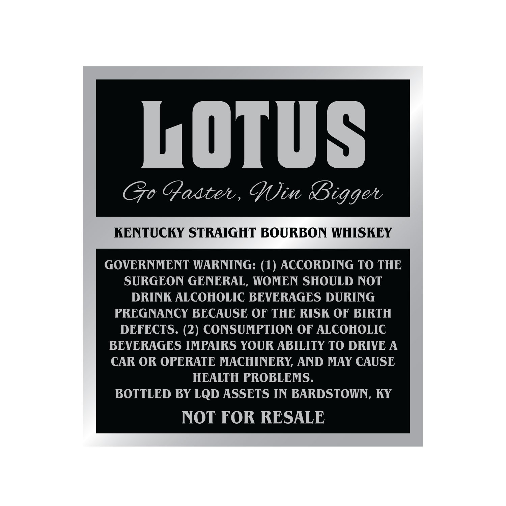
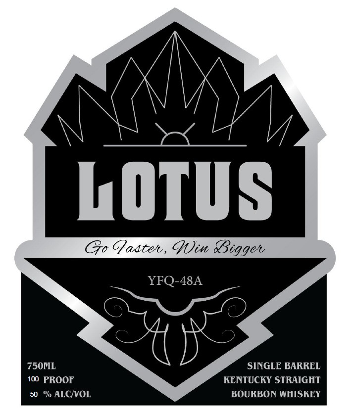

# TTB COLA Label Images - TTBID 26062001000665

**Brand Name:** LOTUS

**Issue Date:** 03/05/2026

**Origin Code:** 22

**Product Class/Type:** 101

**Source:** [TTB Public COLA Registry](https://ttbonline.gov/colasonline/viewColaDetails.do?action=publicFormDisplay&ttbid=26062001000665)

## Label Images

### Back Label

### Front Label

## Extracted Label Text

*Text extracted via OCR - may contain errors*

**Detected Proof:** 100

### Back Label

LOTUS
Go Gaatel , Qin
KENTUCKY STRAIGHT BOURBON WHISKEY
GOVERNMENT WARNING: (1) ACCORDING TO THE
SURGEON GENERAL, WOMEN SHOULD NOT
DRINK ALCOHOLIC BEVERAGES DURING
PREGNANCY BECAUSE OF THE RISK OF BIRTH
DEFECTS. (2) CONSUMPTION OF ALCOHOLIC
BEVERAGES IMPAIRS YOUR ABILITY TO DRIVE A
CAR OR OPERATE MACHINERY; AND MAY CAUSE
HEALTH PROBLEMS_
BOTTLED BY LQD ASSETS IN BARDSTOWN, KY
NOT FOR RESALE
BBigget

### Front Label

LOTUS
GQadtet , Cin
YFQ-48A
750ML
SINGLC BARREL
100 PROOF
KENTUCKY STRAIGHT
50   % ALCIVOL
BOURBON WHISKEY
BBigget
