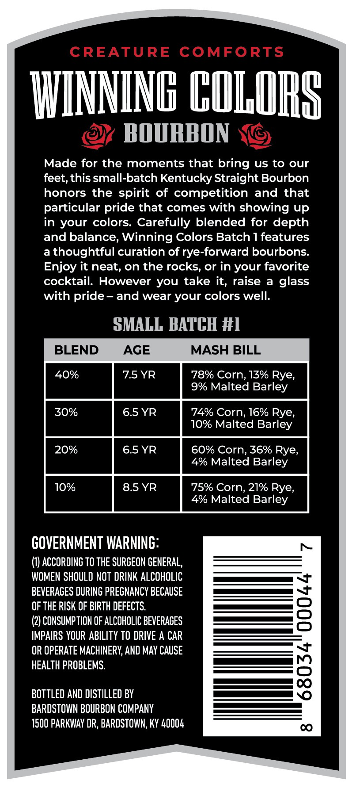
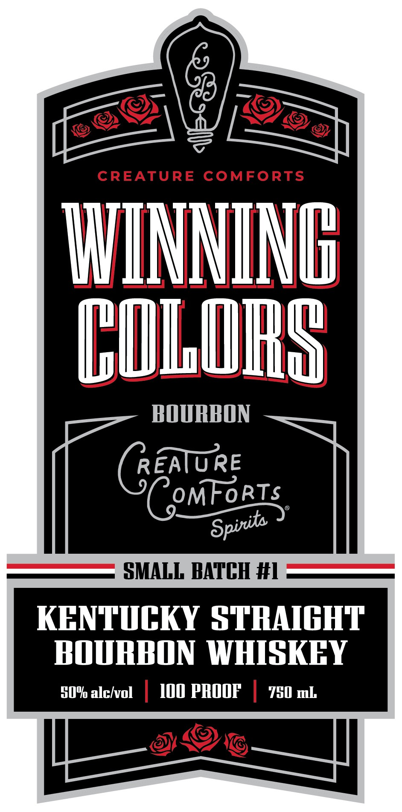
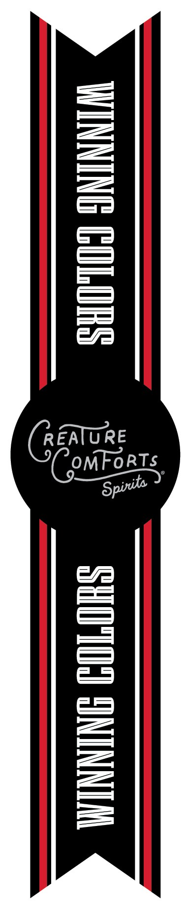

# TTB COLA Label Images - TTBID 26062001000685

**Brand Name:** WINNING COLORS

**Issue Date:** 03/04/2026

**Origin Code:** 22

**Product Class/Type:** 101

**Source:** [TTB Public COLA Registry](https://ttbonline.gov/colasonline/viewColaDetails.do?action=publicFormDisplay&ttbid=26062001000685)

## Label Images

### Back Label

### Front Label

### Label 3

## Extracted Label Text

*Text extracted via OCR - may contain errors*

*1 image(s) excluded: text did not meet readability threshold*

### Back Label

INNING COLORS

BOURBON

Made for the moments that bring us to our

feet, this small-batch Kentucky Straight Bourbon

honors the spirit of competition and that

particular pride that comes with showing up

in your colors. Carefully blended for depth

and balance, Winning Colors Batch 1 features

a thoughtful curation of rye-forward bourbons.

Enjoy it neat, on the rocks, or in your favorite

cocktail. However you take it, raise a glass

with pride- and wear your colors well.

SMALL BATCH #1

BLEND

AGE

MASH BILL

78% Corn, 13% Rye.

9% Malted Barley

4% Corn, 16% Rye,

10% Malted Barley

60% Corn, 36% Rye,

4% Malted Barley

'5% Corn, 21% Rye,

4% Malted Barley

GOVERNMENT WARNING:

(1) ACCORDING TO THE SURGEON GENERAL,

WOMEN SHOULD NOT DRINK ALCOHOLIC

ees

BEVERAGES DURING PREGNANCY BECAUSE

OF THE RISK OF BIRTH DEFECTS.

————

(2) CONSUMPTION OF ALCOHOLIC BEVERAGES

IMPAIRS YOUR ABILITY TO DRIVE A CAR

———

OR OPERATE MACHINERY, AND MAY CAUSE

HEALTH PROBLEMS.

BOTTLED AND DISTILLED BY

BARDSTOWN BOURBON COMPANY

1500 PARKWAY DR, BARDSTOWN, KY 40004

### Front Label

CREATURE
COMFORTS
UIMNING
DULORS
BOURPON
REATURE
CMFoRTs
SMALL HATCH #L
KFNTUCKY STRAIGHT
#OURHON WHISKHY
#0o alckvol
I0O ppOOF
'H0 ml
Spirta
