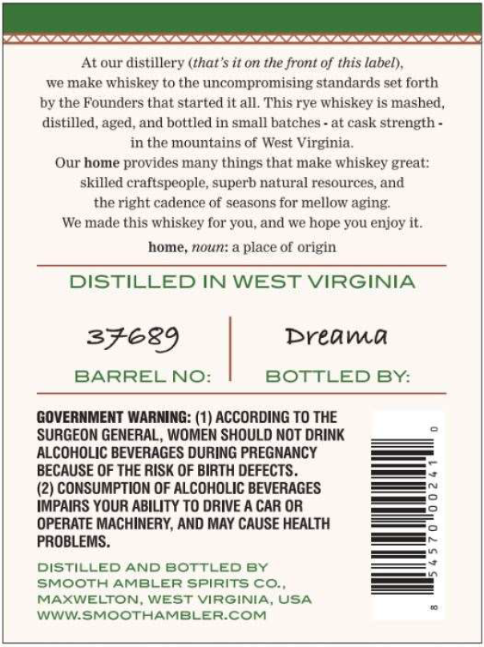
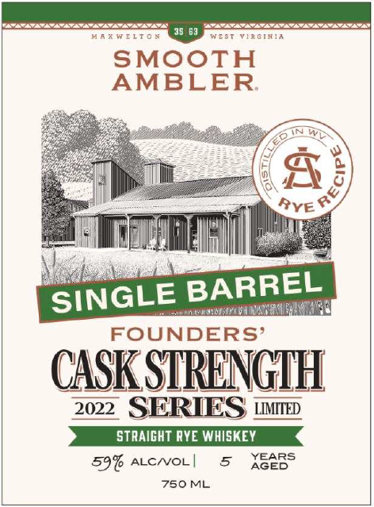
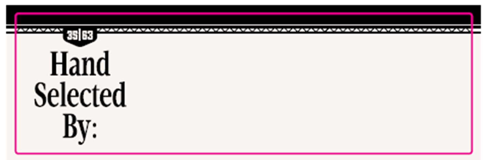

# TTB COLA Label Images - TTBID 26062001000762

**Brand Name:** SMOOTH AMBLER

**Issue Date:** 03/04/2026

**Origin Code:** 47

**Product Class/Type:** 102

**Source:** [TTB Public COLA Registry](https://ttbonline.gov/colasonline/viewColaDetails.do?action=publicFormDisplay&ttbid=26062001000762)

## Label Images

### Back Label

### Front Label

### Label 3

## Extracted Label Text

*Text extracted via OCR - may contain errors*

*1 image(s) excluded: text did not meet readability threshold*

### Back Label

SLSSCSCSCSCSCSCSS SSAC SSCS SNS

At our distillery (that's it on the front of this label),
we make whiskey to the uncompromising standards set forth
by the Founders that started it all. This rye whiskey is mashed,
distilled, aged, and bottled in small batches - at cask strength -
in the mountains of West Virginia.
Our home provides many things that make whiskey great:
skilled craftspeople, superb natural resources, and
the right cadence of seasons for mellow aging.
We made this whiskey for you, and we hope you enjoy it.

home, noun: a place of origin

DISTILLED IN WEST VIRGINIA

SFE89 Breawma
BARREL NO: BOTTLED BY:

GOVERNMENT WARNING: (1) ACCORDING TO THE
SURGEON GENERAL, WOMEN SHOULD NOT DRINK
ALCOHOLIC BEVERAGES DURING PREGNANCY
BECAUSE OF THE RISK OF BIRTH DEFECTS.

(2) CONSUMPTION OF ALCOHOLIC BEVERAGES
IMPAIRS YOUR ABILITY TO DRIVE A CAR OR
OPERATE MACHINERY, AND MAY CAUSE HEALTH
PROBLEMS.

DISTILLED AND BOTTLED BY
SMOOTH AMBLER SPIRITS CO.,
MAXWELTON, WEST VIRGINIA, USA
WWW.SMOOTHAMBLER.COM

### Front Label

SMOOTH

AMBLER

rage

nw

cy

4

t

ihn

Ry

hil

PTE

SINGLE BARREL

FOUNDERS

CASK

STRENGTH

2022 §]

S) LMTED

YEARS

59% arcwvo|

S Ace

750 ML
