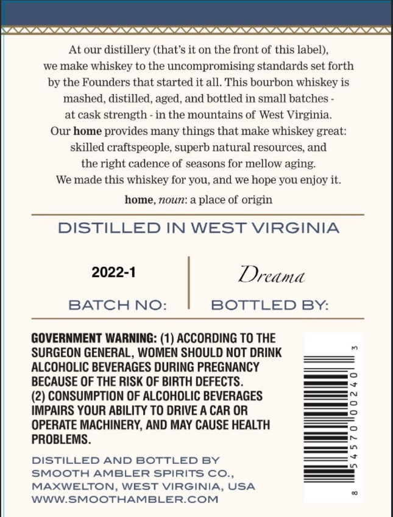
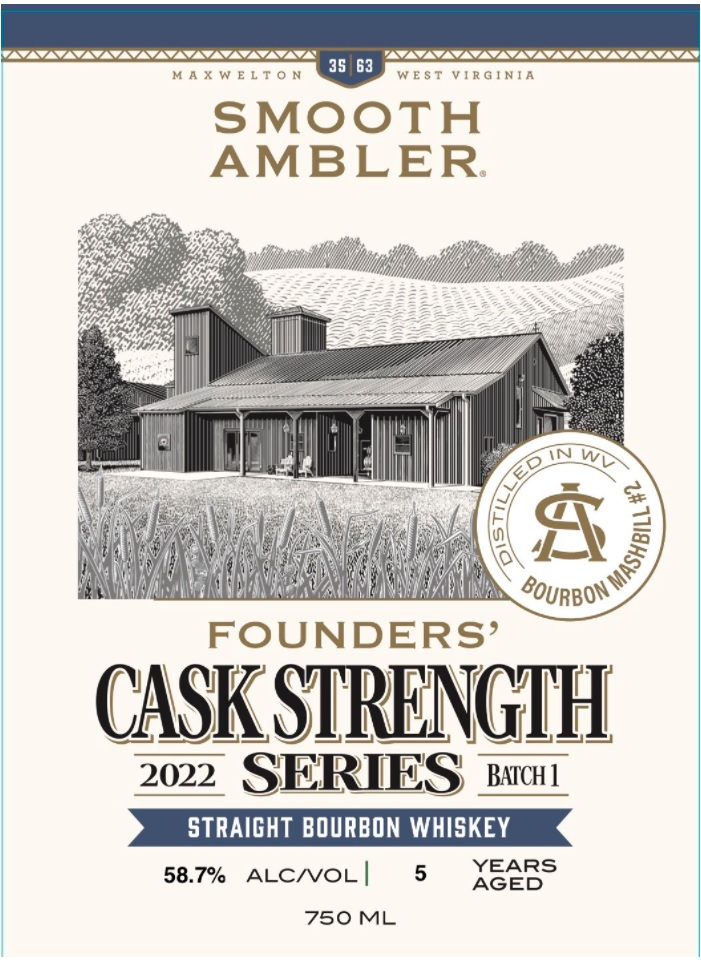

# TTB COLA Label Images - TTBID 26062001000764

**Brand Name:** SMOOTH AMBLER

**Issue Date:** 03/04/2026

**Origin Code:** 47

**Product Class/Type:** 101

**Source:** [TTB Public COLA Registry](https://ttbonline.gov/colasonline/viewColaDetails.do?action=publicFormDisplay&ttbid=26062001000764)

## Label Images

### Back Label

### Front Label

### Label 2

## Extracted Label Text

*Text extracted via OCR - may contain errors*

*1 image(s) excluded: text did not meet readability threshold*

**Detected Proof:** 117.4
**Detected Age:** 5 Years

### Back Label

At our distillery (that'$ it on the front of this label),
we make whiskey to the uncompromising standards set forth
by the Founders that started it all. This bourbon whiskey is
mashed, distilled, aged, and bottled in small batches
at cask
strength
in the mountains of West Virginia.
Our home provides many things that make whiskey great:
skilled craftspeople; superb natural resources, and
the right cadence of seasons for mellow aging:
We made this whiskey for You,and we hope YOU enjoy it.
home, noun: a place of origin
DISTILLED IN WEST VIRGINIA
2022-1
Dreama
BATCH NO:
BOTTLED BY:
GOVERNMENT WARNING: (1) ACCORDING TO THE
SURGEON GENERAL, WOMEN SHOULD NOT DRINK
ALCOHOLIC BEVERAGES DURING PREGNANCY
BECAUSE OF THE RISK OF BIRTH DEFECTS_
(2) CONSUMPTION OF ALCOHOLIC BEVERAGES
IMPAIRS YOUR ABILITY TO DRIVE A CAR OR
OPERATE MACHINERY, AND MAY CAUSE HEALTH
PROBLEMS.
DISTILLED AND BOTTLED BY
SMOOTH AMBLER SPIRITS CO,,
MAXWELTON, WEST VIRGINIA, USA
WWWSMOOTHAMBLERCOM

### Front Label

WSCSCSCSCSCSSSSC SSL

MA

SAAT

35 63

aA ae asie

RGINI

SMOOT

a :

AMBLER

CG

Mow iyg

Yj

pp

co,

YN

lll

l

it

ly

dN =

Foun

FOUNDERS’

2022 SERIES aac

5

YEARS

58.7% ALC/VOL |

AGED

750 ML
