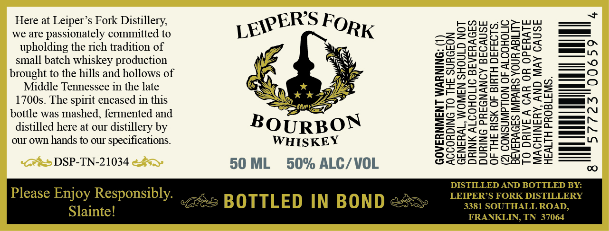

# TTB COLA Label Images - TTBID 26062001000828

**Brand Name:** LEIPER'S FORK DISTILLERY

**Issue Date:** 03/16/2026

**Origin Code:** 43

**Product Class/Type:** 111

**Source:** [TTB Public COLA Registry](https://ttbonline.gov/colasonline/viewColaDetails.do?action=publicFormDisplay&ttbid=26062001000828)

## Label Images

### Label 1

## Extracted Label Text

*Text extracted via OCR - may contain errors*

**Detected Proof:** 100

### Label 1

Here at Leiper’s Fork Distillery,

ow

EOW es;

Opuwiu

Ern

we are passionately committed to

LEER For,

os

pol

ats

cS

WO ce

xitot

cx

ee ON

upholding the rich tradition of

ou

Se

pexprayrey

Owed

wed

ra

small batch whiskey production

Sy:

Pa

cD

=mQI502

brought to the hills and hollows of

&

Zara L

u>cS

é

Sw

Sno

— 2)

Middle Tennessee in the late

kk

SF

Ber

Samnzeae5

1700s. The spirit encased in this

eng

EO

S2u.08se

al

Saas ARON

ZZ

2

SLoS

=

>a

—n

bottle was mashed, fermented and

wotsoa

joss

=n

ee}

m4

—~

distilled here at our distillery by

BOURBON

Za

to

oS2t

—nr

co

Se le

xo

fa

me

=x

wy

our own hands to our specifications.

WHISKEY

SoSsearoa

oh —_—

Sometsuqmo0

DSP-TN-21034

50 ML 50% ALC/VOL

Sztooqo0o8oarsr

DISTILL

BOTTLED BY:

Please Enjoy Responsibly.

LEIPER’S FORK DISTILLERY

BOTTLED IN BOND

3381 SOUTHALL ROAD,

Slainte!

FRANKLIN, TN 37064
