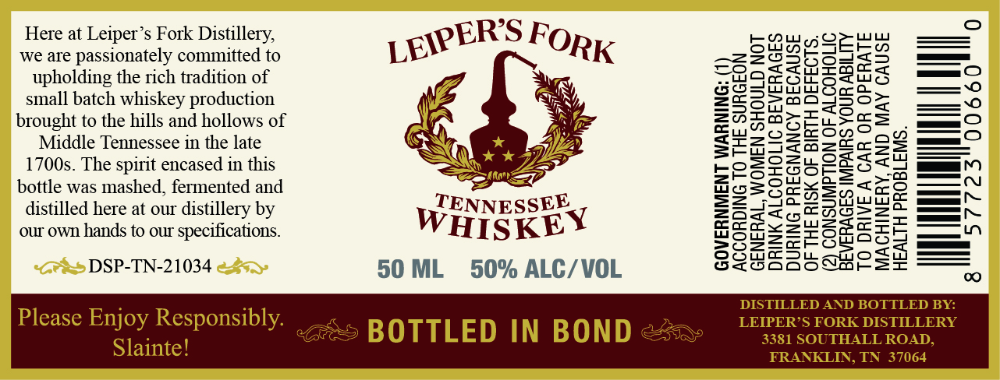

# TTB COLA Label Images - TTBID 26062001000832

**Brand Name:** LEIPER'S FORK

**Issue Date:** 03/16/2026

**Origin Code:** 43

**Product Class/Type:** 119

**Source:** [TTB Public COLA Registry](https://ttbonline.gov/colasonline/viewColaDetails.do?action=publicFormDisplay&ttbid=26062001000832)

## Label Images

### Label 1

## Extracted Label Text

*Text extracted via OCR - may contain errors*

**Detected Proof:** 100

### Label 1

Here at Leiper’s Fork Distillery,
we are passionately committed to
upholding the rich tradition of
small batch whiskey production
brought to the hills and hollows of
Middle Tennessee in the late
1700s. The spirit encased in this
bottle was mashed, fermented and
distilled here at our distillery by
our own hands to our specifications.

DSP-TN-21034

Please Enjoy Responsibly.

Slainte!

TENNESSEE
WHISKEY
50 ML 50% ALC/VOL

BOTTLED IN BOND

GENERAL, WOMEN SHOULD NOT
DRINK ALCOHOLIC BEVERAGES
DURING PREGNANCY BECAUSE
OF THE RISK OF BIRTH DEFECTS.
a CONSUMPTION OF ALCOHOLIC

‘VERAGES IMPAIRS YOUR ABILITY
TO DRIVE A CAR OR OPERATE
MACHINERY, AND MAY CAUSE

GOVERNMENT WARNING: (
ACCORDING TO THE SURGEO

(2)
=
fra
=
faa)
(=)
c
a
as}
2
a=

|
00660

al
—
—~
—~
om_<( <<".
