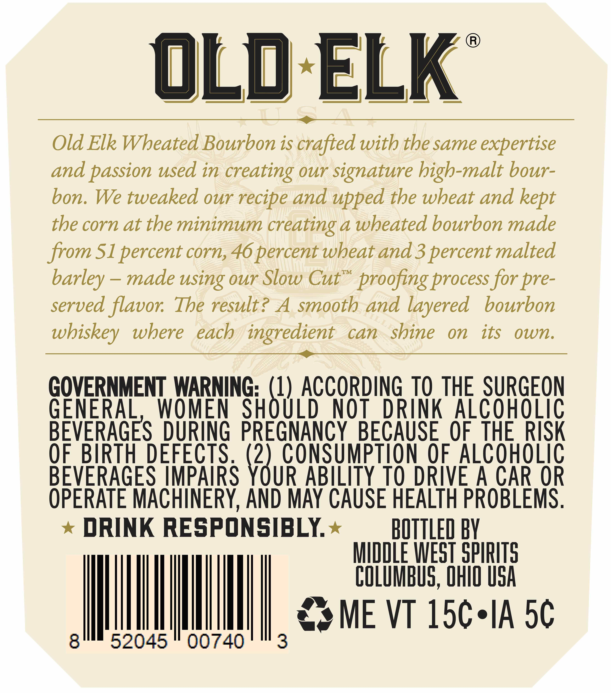
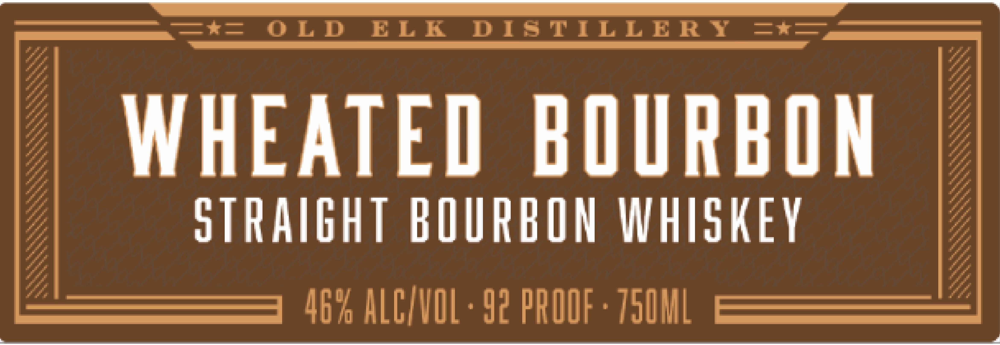

# TTB COLA Label Images - TTBID 26062001001016

**Brand Name:** OLD ELK

**Issue Date:** 03/05/2026

**Origin Code:** 09

**Product Class/Type:** 101

**Source:** [TTB Public COLA Registry](https://ttbonline.gov/colasonline/viewColaDetails.do?action=publicFormDisplay&ttbid=26062001001016)

## Label Images

### Back Label

### Front Label

### Label 4

## Extracted Label Text

*Text extracted via OCR - may contain errors*

*2 image(s) excluded: text did not meet readability threshold*

### Back Label

OLd ELK
Old Elk Wheated Bourbon is crafted with the same expertise
and passion used in creating Our signature high-malt bour-
bon.
We tweaked our recipe and upped the wbeat and
the corn at the minimum
creating a wbeated bourbon made
from Sl percent corn,46 percent wheat and 3 percentmalted
TM
made using our Slow Cut
proofing process for pre-
served flavor:
The result? A smooth and layered
bourbon
wbiskey
wbere
each ingredient
can
shine
on
its
own_
GOVERNMENT WARNING: (1) ACCORDING TO THE SURGEON
GENERAL
WOMEN
SHOULD
NOT
DRINK
AlcohOLiC
BEVERAGES DURING PREGNANCY
BECAUSE   OF THE RISK
OF.BIRTH DEFECTS ; (2),consumptiON of ALcOHOLIC
BEVERAGES IMPAIRS YOUR ABILITY TO DRIVE A CAR OR
OPERATE MACHINERY, AND MAY CAUSE HEALTH PROBLEMS .
DRINK RESPONSIBLY
BOTTLED BV
MiddLE WEST SpIRITS
COLUMBUS, OHIO uSA
ME VT 15c.IA 5c
8
52045
00740
3
kept
barley
S
