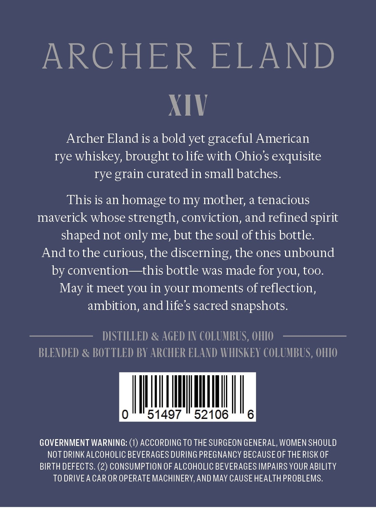
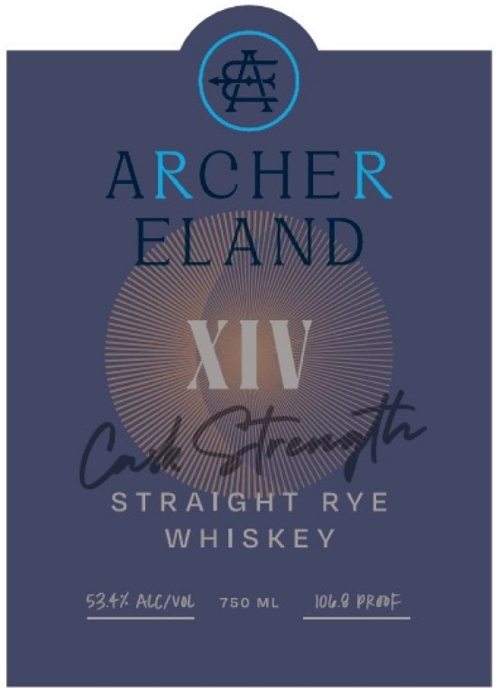

# TTB COLA Label Images - TTBID 26063001000115

**Brand Name:** ARCHER ELAND

**Issue Date:** 03/13/2026

**Origin Code:** 09

**Product Class/Type:** 102

**Source:** [TTB Public COLA Registry](https://ttbonline.gov/colasonline/viewColaDetails.do?action=publicFormDisplay&ttbid=26063001000115)

## Label Images

### Back Label

### Front Label

### Label 3

## Extracted Label Text

*Text extracted via OCR - may contain errors*

### Back Label

ARCHER
ELAND
XIV
Archer Eland is a bold yet graceful American
rye whiskey, brought to life with Ohio s exquisite
rye
curated in small batches.
This is an homage to my mother; a tenacious
maverick whose strength, conviction, and refined spirit
shaped not only me, but the soul ofthis bottle.
Andto the curious, the discerning, the ones unbound
by convention
-this bottle was made for yoU, too.
it meet you in your moments of reflection,
ambition, andlifes sacred snapshots.
DISTILLED
AGED IN COLUMBUS, OHIO
BLENDED & BOTTLED BY ARCHER ELAND WVHISKEY COLUMBUS, OHIO
51497
52106
6
GOVERNMENT WARNING:
ACCORDING TO THE SURGEON GENERAL, WOMEN SHOULD
NOT DRINKALCOHOLIC BEVERAGES DURING PREGNANCY BECAUSE OF THERISK OF
BIRTH DEFECTS. (2) CONSUMPTION OF ALCOHOLIC BEVERAGES IMPAIRS YOUR ABILITY
TO DRIVEA CAR OR OPERATE MACHINERY,AND MAY CAUSE HEALTH PROBLEMS,
grain
May

### Front Label

ARCHER
EvND
XIV
CCt
STRATGAT
RY E
W HISKEY
5347 Alc/vol
750 ML
Iob.9 pRoF

### Label 3

bail acme of longue of oronge Elasons, fal fragrance and french vanilla:

¢ oy
See liye ‘ nN oe
ated 7 missy A
cae ewe YS EES: Sig
go, Be SS ad)
e p= Sy RR N ¢
ies = f eit: ae POS 2 VFR NY
