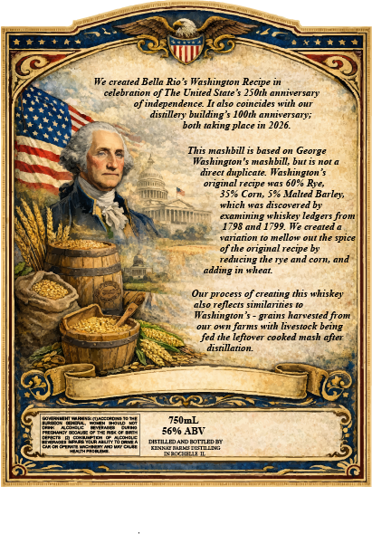
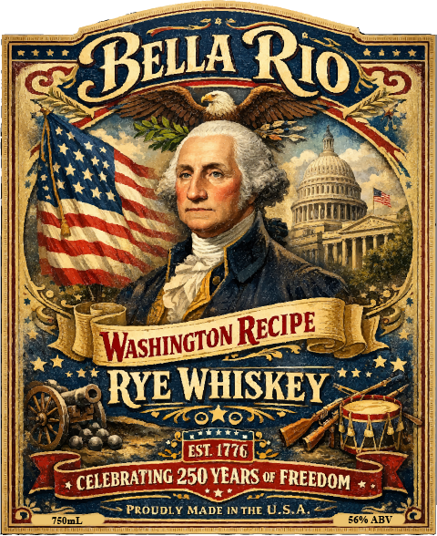

# TTB COLA Label Images - TTBID 26063001000165

**Brand Name:** BELLA RIO WASHINGTON RECIPE RYE WHISKEY

**Issue Date:** 03/11/2026

**Origin Code:** 04

**Product Class/Type:** 142

**Source:** [TTB Public COLA Registry](https://ttbonline.gov/colasonline/viewColaDetails.do?action=publicFormDisplay&ttbid=26063001000165)

## Label Images

### Back Label

### Front Label

## Extracted Label Text

*Text extracted via OCR - may contain errors*

### Back Label

We created Bella Rio' $
Washington
celebration of The United State $ 25Oth anniversary
of independence_
also coincides with our
distillery building
10Oth anniversary;
both taking place in 2026.
This mashbill is based on George
Washington' $ mashbill, but is not a
direct duplicate. Washington $
original recipe sas 60%0 Rree;
359 Com; 5% Malted Barley;
which was
415covetrdnhi=
examining whiskey ledgers from
1798 and 1799. We created
Vonanol
Mellow out the spice
of the original recipe by
reducing the rye and
cori
and
adding
uwat
Our process of creating this whiskey
eflects similavities
Washington =
uarrsedtronn
Own farms with livestock being
fed the leftover cooked
mhasa
after
distillation
#0mL
569/0 ABV
coTTDM
ETLN;
Recipe
grains

### Front Label

BELLA
WASHNGIONRECIpE
RYE WHISKEY
EST 1776
CELEBRATING 250 YEARS o FREEDOM
PROUDLY MADE IN THE U.S.A.
EUmL
8690 ABV
Rio
