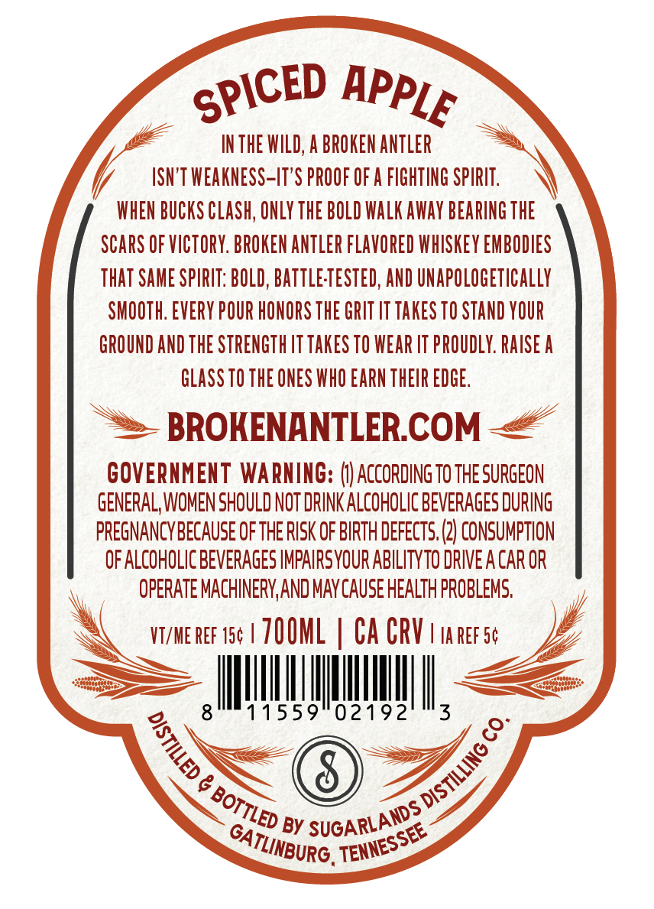
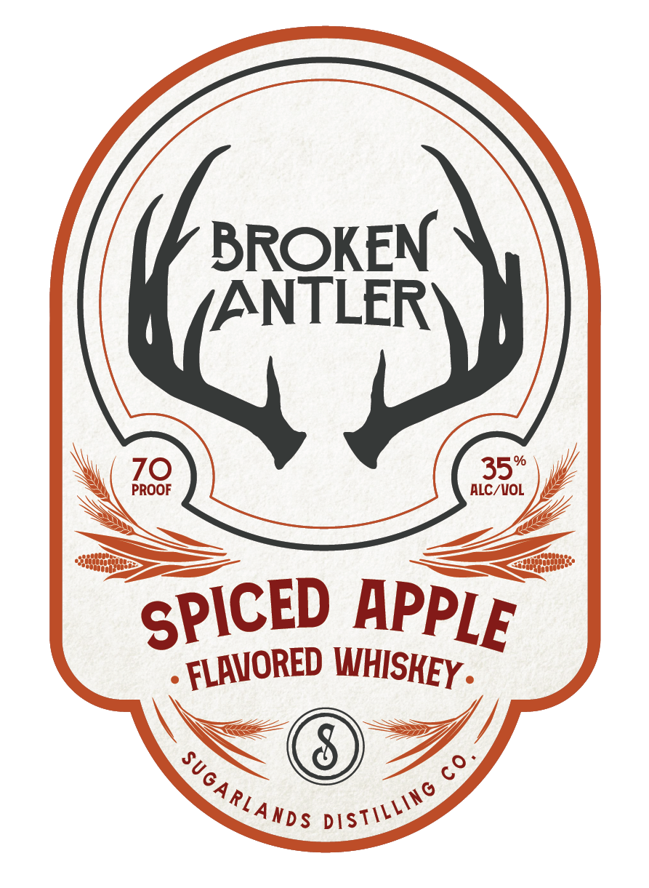

# TTB COLA Label Images - TTBID 26063001000220

**Brand Name:** BROKEN ANTLER

**Issue Date:** 03/09/2026

**Origin Code:** 43

**Product Class/Type:** 149

**Source:** [TTB Public COLA Registry](https://ttbonline.gov/colasonline/viewColaDetails.do?action=publicFormDisplay&ttbid=26063001000220)

## Label Images

### Back Label

### Front Label

## Extracted Label Text

*Text extracted via OCR - may contain errors*

### Back Label

INTHE WILD; A BROKEN ANTLER
ISN 'T WEAKNESS-IT'S PROOF OF A FIGHTING SPIRIT ;
WHEN BUCKS CLASh; ONLY THE BOLD WalK away BEARING THE
SCARS OF VICTORY. BROKEN aNTLER FLAVORED WhISKeY EMBODIES
That SAME SPIRIT: BOLD, BattLeTESTED, AND UNapoLOGETIcallY
SMOOTH: EVERY POUR HONORS THE GRIT LT takeS TO STAND YOUR
GROUND AND THE STRENGTH T TAkES TO WEAR IT PROuDLY: RAISE A
GLASS TO THE ONES WHO EARN THEIR EDGE;
BROKENANTLERCOM
GOVERNMENT WARNING:
AcCoRding TO THE SURGEON
GENERAL, WOMEN SHOULD NOT DRINK ALCOHOLIC BEVERAGES DURING
PREGNANCYBECAUSE OF THE RISK OF BIRTH DEFECTS: (2] CONSUMPTION
OF ALCOHOLIC BEVERAGES IMPAIRSYOUR ABILITYTO DRIVE A CAr OR
OPERATE MACHINERYAND MAYCAUSE HEALTH PROBLEMS;
VT/ME REF 154
ZOOML
CA CRV
Ia REF 5c
11559
02192
3
8
8
BY
SPICED
APPLE
1
DISTILLING €
BOTTLED "
SUGARLANDS
TENNESSEE
GATLINBURG .

### Front Label

BROKEN
ANTLER
70
35'
PROOF
ALC/ VOL
69
SPICED
APPLE
FLAVORED
WHISKEY =
SUGA RLANDS
Distilling
