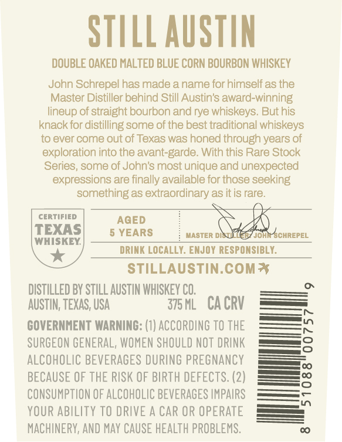
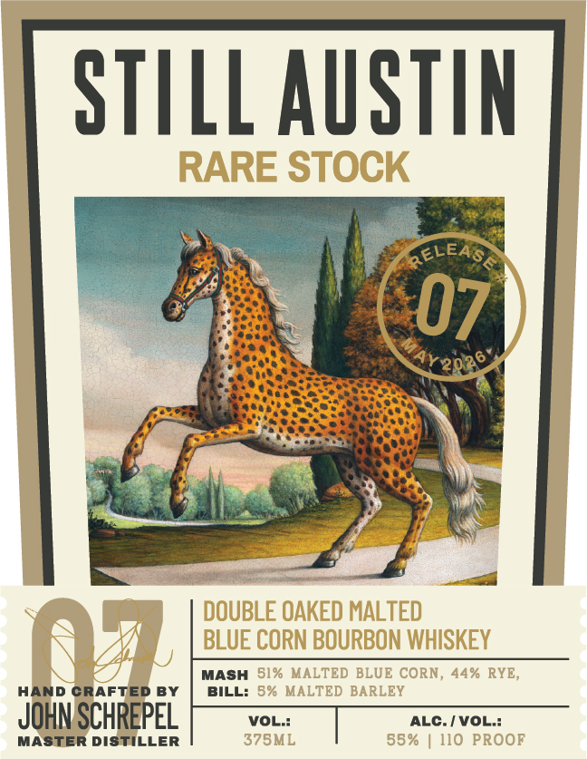
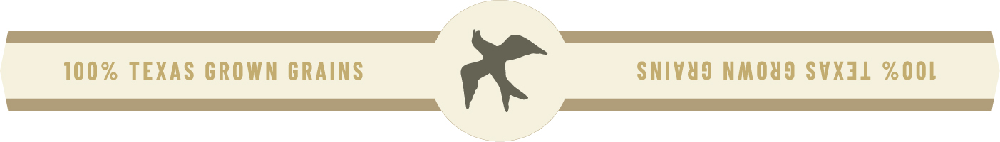

# TTB COLA Label Images - TTBID 26063001000318

**Brand Name:** STILL AUSTIN

**Fanciful Name:** RARE STOCK

**Issue Date:** 03/11/2026

**Origin Code:** 44

**Product Class/Type:** 141

**Source:** [TTB Public COLA Registry](https://ttbonline.gov/colasonline/viewColaDetails.do?action=publicFormDisplay&ttbid=26063001000318)

## Label Images

### Back Label

### Front Label

### Label 3

## Extracted Label Text

*Text extracted via OCR - may contain errors*

**Detected Proof:** 85
**Detected Age:** 5 Years

### Back Label

STILL AuSTIN
DOUBLE OAKED MALTED BLUE CORN BOURBON WHISKEY
John Schrepel has made a name for himself as the
Master Distiller behind Still Austin's award-winning
lineup of straight bourbon and rye whiskeys. But his
knack for distilling some of the best traditional whiskeys
to ever come out of Texas was honed through years of
exploration into the avant-garde. With this Rare Stock
Series, some of John's most unique and unexpected
expressions are finally available for those seeking
something as extraordinary as itis rare_
CERTIFIED
AqED
TEXAS
5 YEARS
MASTER DA
JohaSCHREPEL
WHISKEY
DRINK LOCALLY: EMJOY RESPONSIBLY:
STILLAUSTIN.COM*
DISTILLED BY STILL AUSTIN WHISKEY CO,
AUSTIN, TEXAS, USA
375 ML
CA CRV
GOVERNMENT WARNING: (1) ACCORDING TO THE
SURGEON GENERAL, WOMEN SHOULD NOT DRINK
3
ALCOHOLIC BEVERAGES DURING PREGNANCY
BECAUSE OF THE RISK OF BIRTH DEFECTS. (2)
3
CONSUMPTION OF ALCOHOLIC BEVERAGES IMPAIRS
YOUR ABILITY TO DRIVE A CAR OR OPERATE
MACHINERV, AND May CAUSE HEALTh PROBLEMS:

### Front Label

STILL AuStin
RARE STOCK
ReLEASA
07
Y2026
DOUBLE OAKED MALTED
(
BLUE CORN BOURBON WHISKEY
MASH81% MALTED BLUE CORN, 44% RYE,
HAND CRAFTED BY
BILL: 8% MALTED BARLEY
JOHN SCHREPEL
VOL::
ALC-/VoL::
MASTER DistilLeR
375ML
85%
110 PROOF

### Label 3

100% TEXAS GROWN GRAINS

SNIVUS NMOUS SVXIL ZOOL

ad
