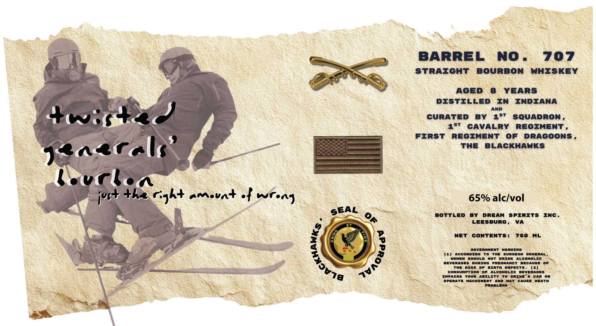

# TTB COLA Label Images - TTBID 26063001000321

**Brand Name:** DREAM SPIRITS, INC.

**Issue Date:** 03/06/2026

**Origin Code:** 05

**Product Class/Type:** 101

**Source:** [TTB Public COLA Registry](https://ttbonline.gov/colasonline/viewColaDetails.do?action=publicFormDisplay&ttbid=26063001000321)

## Label Images

### Label 1

## Extracted Label Text

*Text extracted via OCR - may contain errors*

**Detected Proof:** 130
**Detected Age:** 8 Years

### Label 1

BARREL
NO .
707
STRAIGHT
BOURBON
WHISKEY
AGeD
8
YEARS
DISTILLED
IN
INDIANA
AND
460+4
CURATED
BY
187
SQUADRON
1st
CAVALRY
REOIMENT =
FIRST
REOIMENT
0f
DRAGOONS ,
ThE
BLACKHAWKS
faras
lovrle
+K2 rgat amsat .
65% alc/vol
BOTTLED
BY
DREAM
SPIRITS
INc _
Leesburg ,
VA
NeT
CONTENTs :
750
ML
OOVERNMENT
WARNINO
(1)
AccORDINO
To
The
suroeon} Oeneral
Hohen
shouLD
Not
DRINK
ALCOHOLIC
BEVERAOES
DURINO
PREONAncy
BECAUSE
OF
The
RISK
BIRTH
DefeCTS
(2)
CONSUMPTION
OF
ALCOHOLIC
Beveraoes
IMPAIRS
Your
ABILITY
To
DRIVE
CAR
OR
OPERate
AAcHINERY
AND
MaY
CAUSE
HEAth
PROBLEMS
jY5+
Wm a)
SEAL
OF
"
)
(
