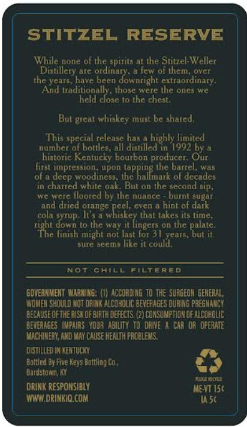
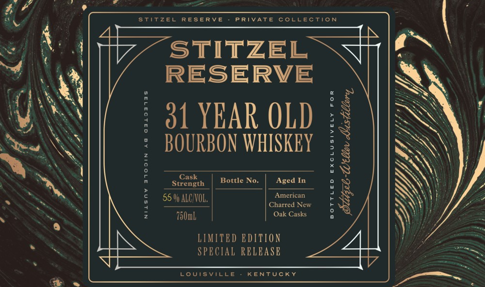

# TTB COLA Label Images - TTBID 26063001000497

**Brand Name:** STITZEL RESERVE

**Issue Date:** 03/05/2026

**Origin Code:** 22

**Product Class/Type:** 141

**Source:** [TTB Public COLA Registry](https://ttbonline.gov/colasonline/viewColaDetails.do?action=publicFormDisplay&ttbid=26063001000497)

## Label Images

### Back Label

### Front Label

## Extracted Label Text

*Text extracted via OCR - may contain errors*

**Detected Age:** 30 Years

### Back Label

STITzel RESERVE
While none of the spirits at the Stitzel-Weller
Distillery are
Tew ol tem
Ovcr
Ihc ycars , have becn
extraordinary .
And traditionally, those were the ones we
held close t0 the chest,
But great whiskey must be shared,
This special release has a highly limited
number of bollles; all distilled i 1992 by
historic Kentucky bourbon producer
Our
First impression
upon
the barrel; Was
woodines:
the
the Ralknae
ol decades
in charred while oak;
But on the second sip,
We wcre floored by thc nuance
burnt sugar
and dried orange
Cven
hint of dar
cola syiup: It >
expectes
Ithat takes its time
down l0 he way
On Ine
rihe $
finish might not last for 30 years , but it_
sure geems like i could;
Not
chILL
Piltered
GOVERHMENT WARMING: (I) ACCOADING T0 The SURGEOM GEMERAL ,
WOMEH SHOULD MOT DAINK ALCOHOUC beverageS OurING PREGMANCY
DECAUSE OF THE RISK OF BIRTH defEctS. (2) CONSUMPTIOK OF NcOHOLIC
Deveanses IMPAIOS  YOUR ABILITY  T0 LANE
CAR 03  operute
MACHINERI ^4O MAy CAUSE HENJH PROBLEMS.
dISTILLED MkentucM
Bottled By Fwve Keys Botuling Co,
Bardstown Ky
Lurmu
~DRINK reSpoMSIBLY
MEVT 15(
WWIDRINKIO COM
#5t
ordina Jowntight
deep
lingers
palale.

### Front Label

stitzel
RESERvE
PRTVATE
collection
STITZEL
RESERVE
31 YEAR OLD
BOURBON WHISKEY
5
:
3
Cask
Bottle No.
Aged In
Strength
55 9 ALCAOL;
American
2
{
Charred New
750mL
Oak Casks
LIMITED EDITION
SPECIAL RELEASE
LoUISvILLE
KENTUCKY
[
