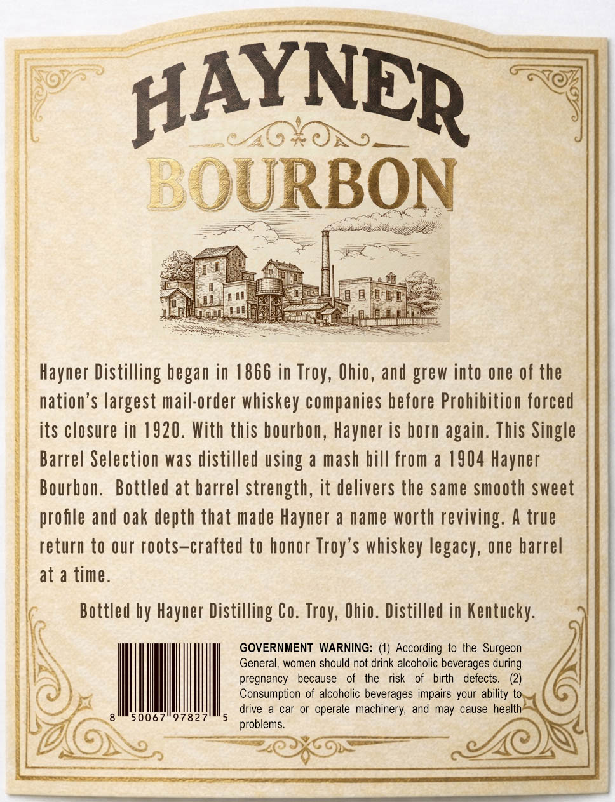
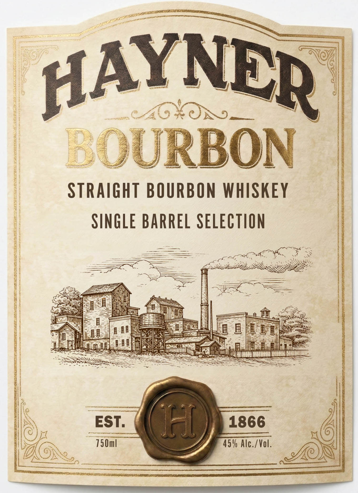

# TTB COLA Label Images - TTBID 26063001000505

**Brand Name:** HAYNER

**Issue Date:** 03/06/2026

**Origin Code:** 09

**Product Class/Type:** 101

**Source:** [TTB Public COLA Registry](https://ttbonline.gov/colasonline/viewColaDetails.do?action=publicFormDisplay&ttbid=26063001000505)

## Label Images

### Back Label

### Front Label

## Extracted Label Text

*Text extracted via OCR - may contain errors*

**Detected Proof:** 90

### Back Label

HAYNER
ON_
BOURBON
Hayner Distilling began in 1866 in
Ohio, and grew into one of the
nation'$ largest mail-order whiskey companies before Prohibition forced
its closure in 1920. With this bourbon, Hayner is born
This Single
Barrel Selection was distilled using a mash bill from a 1904 Hayner
Bourhon:
Bottled at barrel strength, it delivers the same smooth sweet
profle and oak depth that made Hayner a name worth reviving: A true
return to our roots-crafted to honor Troy'$ whiskey legacy, one barrel
at a time.
Bottled by Hayner Distilling Co.
Ohio. Distilled in Kentucky:
GOVERNMENT WARNING: (1) According to the Surgeon
General, women should not drink alcoholic beverages during
pregnancy
because
the
risk
birth
defects
Consumption of alcoholic beverages impairs your ability to
drive
car or operate
machinery, and may cause health
50067
97827
problems
Troy,
again.
Troy,

### Front Label

PE

ql

Y]

—_/ ~ ead)

MOXOS

R

aps

Soe

RBON

STRAIGHT BOURBON WHISKEY

SINGLE BARREL SELECTION

———

—

Mae

—

vate

SS

=

os

Legg

rT

fi

(ine Z)

fat

|

SSS

cree

Se

SSS

Ht

SAN

EST

=

1866

750ml

45% Alc./Vol

(Re,
