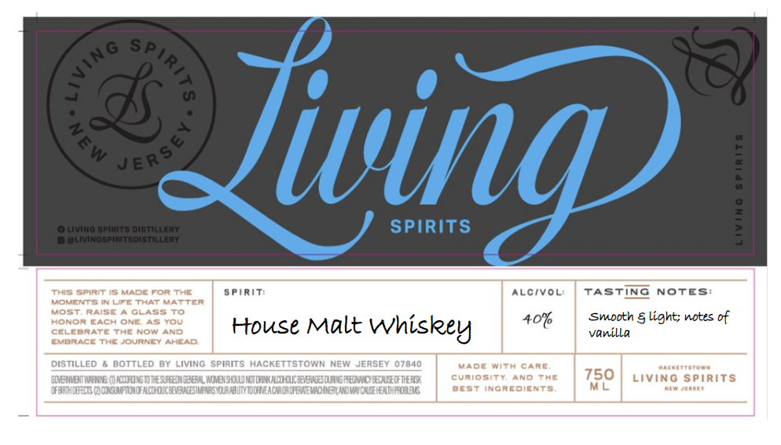

# TTB COLA Label Images - TTBID 26063001000577

**Brand Name:** LIVING SPIRITS

**Fanciful Name:** HOUSE MALT WHISKEY

**Issue Date:** 03/06/2026

**Origin Code:** 03

**Product Class/Type:** 118

**Source:** [TTB Public COLA Registry](https://ttbonline.gov/colasonline/viewColaDetails.do?action=publicFormDisplay&ttbid=26063001000577)

## Label Images

### Label 1

### Label 2

## Extracted Label Text

*Text extracted via OCR - may contain errors*

*1 image(s) excluded: text did not meet readability threshold*

### Label 1

Sp
n
2
4
Sw
Jiving)
1
3
0Living spirits oistillery
SPIRITS
3
Olivingspiritsdistillery
This Spirm GMADE For ThE
5 PiRIT:
ALCiVOL:
TaStinG
NotEs:
VOKENTS IR LFC ThATMATTER
MoS
RAISE
GLASS To
Honor EACH ONE 48You
ttouse Malt
Whiskey
407
Smooth & light; notes of
CELEARAS
F
Now AND
vanilla
EMORACE THEJOURNET
EHEAG
distILLeD
boTTLED BY
LIVING
spirits HACKETTSTOWN Nei JerseY 07840
ADETA CARE
Haeeltoet
G0BoTWaIG
@aGoTESEDDEL MBISOI
[aadW REImgeeyicEarqienX
curio
ty
AND TAE
750
LIVING sPIRITS
0Fdphh ezt@mpfiuf alooicaentimrioahvmmmeaciadatfextwoienowaclriuimawog
BEST incredients
ML
Uan
{
4
JERSe
