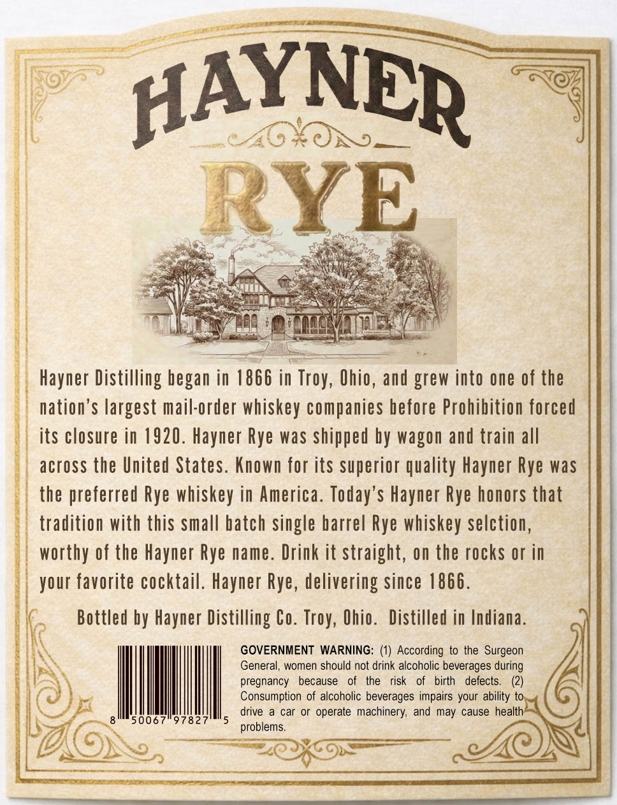
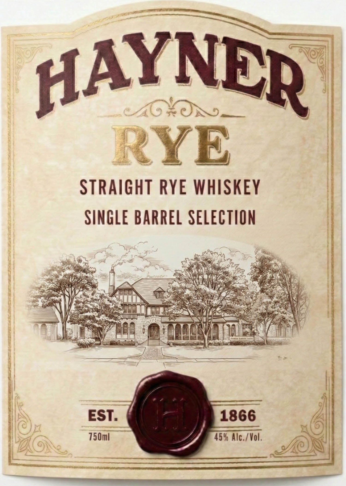

# TTB COLA Label Images - TTBID 26063001000609

**Brand Name:** HAYNER

**Issue Date:** 03/06/2026

**Origin Code:** 09

**Product Class/Type:** 102

**Source:** [TTB Public COLA Registry](https://ttbonline.gov/colasonline/viewColaDetails.do?action=publicFormDisplay&ttbid=26063001000609)

## Label Images

### Back Label

### Front Label

## Extracted Label Text

*Text extracted via OCR - may contain errors*

*1 image(s) excluded: text did not meet readability threshold*

### Back Label

HAYNER
46
RYE
Hayner Distilling began in 1866 in Troy, Ohio, and grew into one of the
nation'$ largest mail-order whiskey companies before Prohibition forced
its closure in 1920. Hayner Rye was shipped by wagon and train all
across the United States. Known for its superior quality Hayner Rye was
the preferred Rye whiskey in America. Today'$ Hayner Rye honors that
tradition with this small batch single barrel Rye whiskey selction,
worthy of the Hayner Rye name. Drink it straight, on the rocks or in
your favorite cocktail. Hayner Rye, delivering since 1866.
Bottled by Hayner Distilling Co.
Ohio.
Distilled in Indiana.
GOVERNMENT WARNING: (1) According to the Surgeon
General, women should not drink alcoholic beverages during
pregnancy
because
the
risk
birth
defects
Consumption of alcoholic beverages impairs your ability to
drive
car or operate machinery, and may cause health
50067
97827
problems
Ux )-
Troy,
