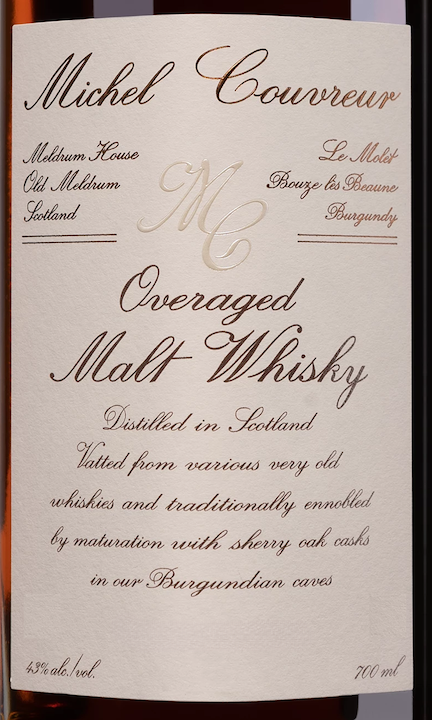
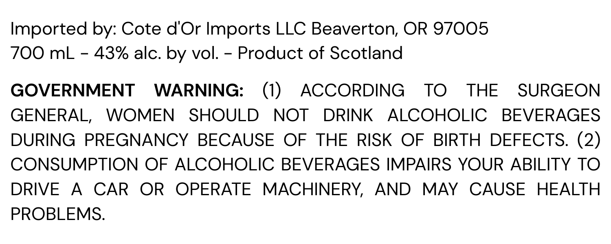

# TTB COLA Label Images - TTBID 26063001000892

**Brand Name:** MICHEL COUVREUR

**Fanciful Name:** OVERAGED MALT WHISKY

**Issue Date:** 03/13/2026

**Origin Code:** 5K

**Product Class/Type:** 118

**Source:** [TTB Public COLA Registry](https://ttbonline.gov/colasonline/viewColaDetails.do?action=publicFormDisplay&ttbid=26063001000892)

## Label Images

### Label 1

### Label 2

## Extracted Label Text

*Text extracted via OCR - may contain errors*

**Detected Proof:** 86

### Label 1

xtckel
lldum MGuse
Se,fbolet
(tl tbeldum
OBeaune
Sotland
'216"-
(Osenaged
Jllh
Distill _
in
Sotlamd
Ittedl fom
saliouo
eery old
whiskies and taditionalby enolled
6y matunalion with shemrt cak cask
ouf"
BBungundian
cnes
'8alehxl
760 ml
CGouvewr
Obuaqundy
efflisky

### Label 2

Imported by: Cote d'Or Imports LLC Beaverton; OR 97005
700 mL
43% alc. by vol.
Product of Scotland
GOVERNMENT
WARNING:
(1)
ACCORDING
TO
THE
SURGEON
GENERAL,
WOMEN
SHOULD
NOT
DRINK
ALCOHOLIC
BEVERAGES
DURING
PREGNANCY
BECAUSE
OF
THE
RISK OF
BIRTH
DEFECTS. (2)
CONSUMPTION OF ALCOHOLIC BEVERAGES IMPAIRS YOUR ABILITY TO
DRIVE
A
CAR
OR
OPERATE
MACHINERY,
AND
MAY
CAUSE
HEALTH
PROBLEMS:
