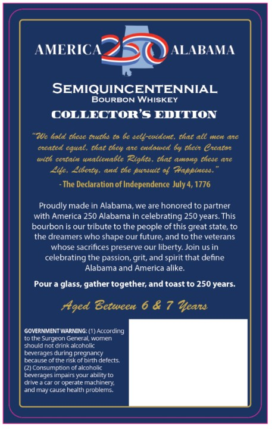
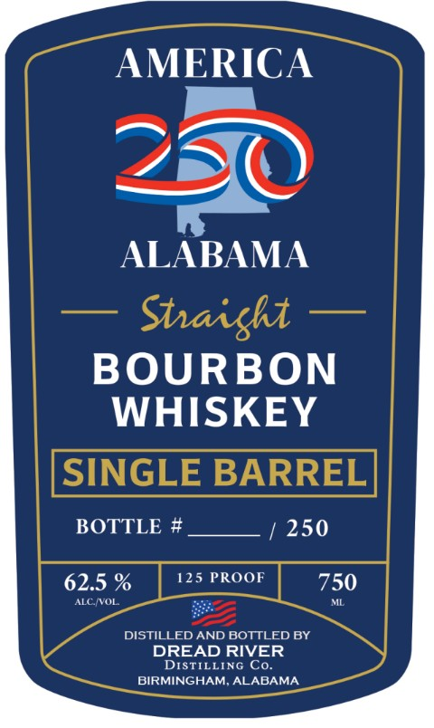
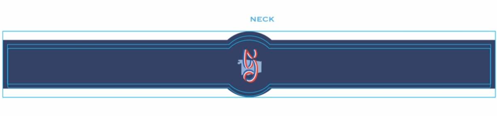

# TTB COLA Label Images - TTBID 26063001000952

**Brand Name:** DREAD RIVER DISTILLING CO.

**Fanciful Name:** AMERICA 250 ALABAMA

**Issue Date:** 03/05/2026

**Origin Code:** 10

**Product Class/Type:** 101

**Source:** [TTB Public COLA Registry](https://ttbonline.gov/colasonline/viewColaDetails.do?action=publicFormDisplay&ttbid=26063001000952)

## Label Images

### Back Label

### Front Label

### Label 3

## Extracted Label Text

*Text extracted via OCR - may contain errors*

*1 image(s) excluded: text did not meet readability threshold*

**Detected Proof:** 125

### Back Label

AMERICA
ALABAMA
SEMIQUINCENTENNIAL
BoURBON WHISKEY
COLLECTOR'S EDITION
"ZUe kold these tuths ta 6e sel}-euident,
thar all Ier arC
ereated equal , that they are eudated 64 thete Creatar
centain unalienable igata
that amona thede are
Lte. Liberty. ad the fursuit & Zapeinese.
The
Declaration of Independence July 4, 1776
Proudly made in Alabama, we are honored t0 partner
with America 250 Alabama in celebrating 250 years.This
bourbon is our tribute to the people ofthis great state,to
the dreamers who shape our future, and to the veterans
whose sacrifices preserve our liberty. Join us in
celebrating the passion, grit, and spirit that define
Alabama and America alike.
Pour a glass, gather together;and toast to 250 years
Aged Between 6 & 7 Iear
GOVERNMENT WARNING: (1) According
tothe Surgeon General Komnen
should not drink alcoholic
beverages during pregnancy
because ofthe nisk of binth deterts
(2) Consumption of akcoholic
Leverages impaltsyour abllity t0
drve
operate machinery
and may cause health problems.
tttk

### Front Label

AMERICA
ALABAMA
Staisht
BOURBON
WHISKEY
SINGLE BARREL
BOTTLE #
250
62.5 %
125 PROOF
750
ALC NVOL
DISTILLED AND BOTTLED BY
DREAD RIVER
DISTILLING Co_
BIRMINGHAM; ALABAMA
