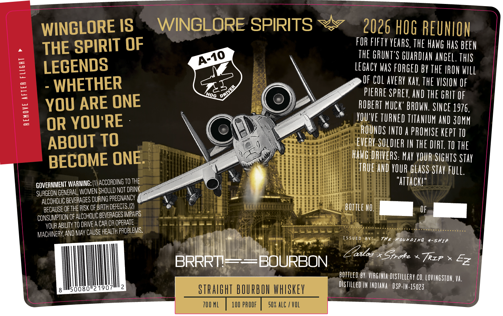

# TTB COLA Label Images - TTBID 26064001000128

**Brand Name:** WINGLORE SPIRITS

**Fanciful Name:** BRRRT! BOURBON

**Issue Date:** 03/05/2026

**Origin Code:** 05

**Product Class/Type:** 101

**Source:** [TTB Public COLA Registry](https://ttbonline.gov/colasonline/viewColaDetails.do?action=publicFormDisplay&ttbid=26064001000128)

## Label Images

### Label 1

## Extracted Label Text

*Text extracted via OCR - may contain errors*

**Detected Proof:** 100

### Label 1

WINGLORE IS
WINGLORE SPIRITS
2026 HOG REUNLON
THE SPIRIT OF
FOR FIFTY YEArS, THE HAWG HaS BEEH
5
THE GRUHT'S GUARDIAN ANGEL. ThIS
LEGENDS
LEGACY WaS FORGED BY THE IROH WIll
WHETHER
OF COL avERY KaY, THE VISLOU €F
0
PIERRE SPREY, AND THE GRIT €F
YOU ARE ONE
ROBERT MUCK' BROWU: SIHCE 1976,
=
3
OR YOU'RE
YOU'VE TURNED TITANLUM AND 3OMM
ROUNDS INTO
PROMUSE KEPT TO
ABOUT TO
EVERY SOLDIER IH THE DIRT; TO The
BECOME ONE
HAWG DRIVERS: MaY YOUR SIGHTS STay
ITRUE AND YOUR glaSS STay Full:
GOVERHMEHT WARNING: | VACCORDING Tothe
"attackl"
SurGeon GeneRal women SHould NoT DrwK
ALCOHOLIC GevEpages DURING PREGNANCY
BEGAUSE OF THE RISK OF BIRTH DEFECTS./2|
bottle NO,
Consumption OF ALCOHOUC BevePAGES MPaRS
YOUR AbIITV TO DRWE A GAR OR OpeRATE
MAChnery, AND May Cause HEAlTh PROBLEmS:
ISsU
The
OuXDIXG
#-S#IP
oslos
Stroke
Trzp
BRRRT
BOURBON
Ez
bottled BY: VRGINIA DistILLeRy CO. LOVIHGSTOH,Va.
Distilled IN INDIANA
DSP-IN-15023
08
STRalght BOURBON whSkeY
700 ML
100 PROOF
50K alc
VOL
A-10
3
ORIVER
Hog
