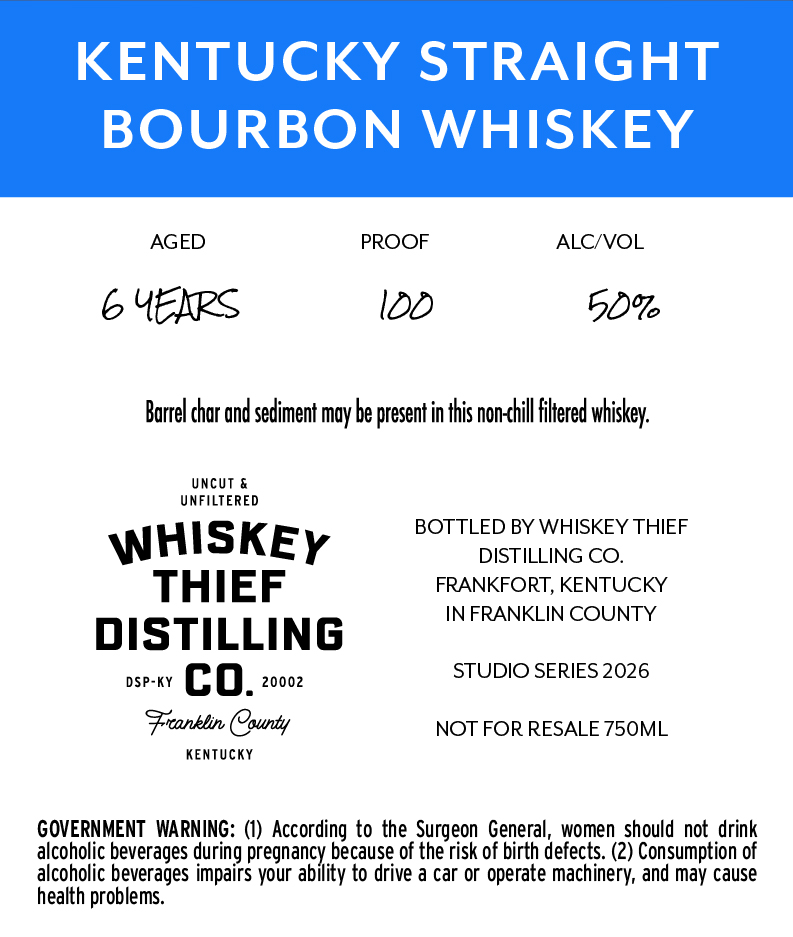
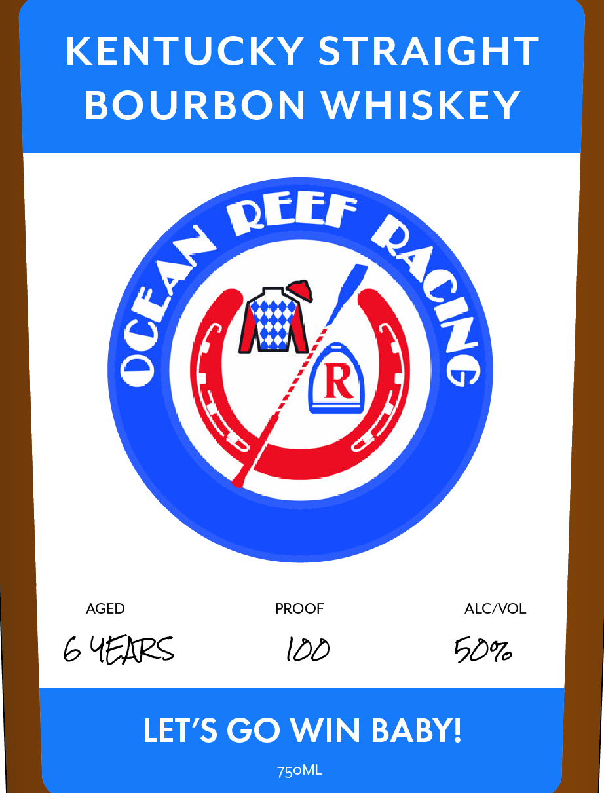

# TTB COLA Label Images - TTBID 26064001000191

**Brand Name:** WHISKEY THIEF DISTILLING CO.

**Fanciful Name:** OCEAN REEF RACING

**Issue Date:** 03/05/2026

**Origin Code:** 22

**Product Class/Type:** 101

**Source:** [TTB Public COLA Registry](https://ttbonline.gov/colasonline/viewColaDetails.do?action=publicFormDisplay&ttbid=26064001000191)

## Label Images

### Back Label

### Front Label

## Extracted Label Text

*Text extracted via OCR - may contain errors*

### Back Label

KENTUCKY STRAIGHT

BOURBON WHISKEY

AGED PROOF ALC/VOL

6 4YEXRS 100 50%

Barrel char and sediment may be present inthis non-<hll filtered whiskey.

UNFILTERED
BOTTLED BY WHISKEY THIEF
WHISKEy DISTILLING CO.

THIEF FRANKFORT, KENTUCKY

IN FRANKLIN COUNTY

DISTILLING

assvee (EQ), sons STUDIO SERIES 2026

‘Franklin County NOT FOR RESALE 750ML

KENTUCKY

GOVERNMENT WARNING: (1) According to the Surgeon General, women should not drink
alcoholic beverages during pregnancy because of the risk of birth defects. (2) Consumption of
alcoholic beverages impairs your ability to drive a car or operate machinery, and may cause
health problems.

### Front Label

KENTUCKY STRAIGHT
BOURBON
WHISKEY
QEEr
R
LET'S GO WIN BABYI
750ML
1
{
