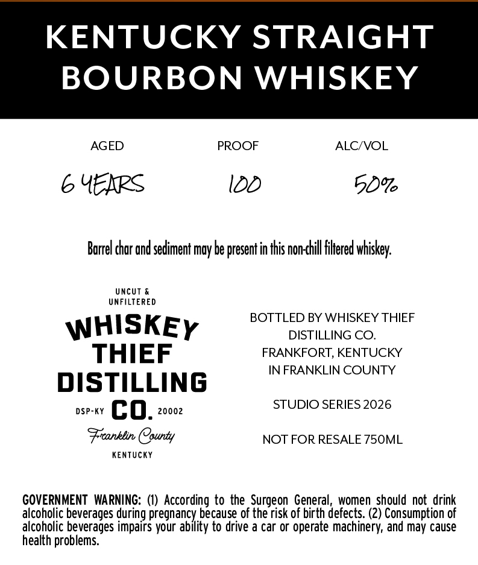
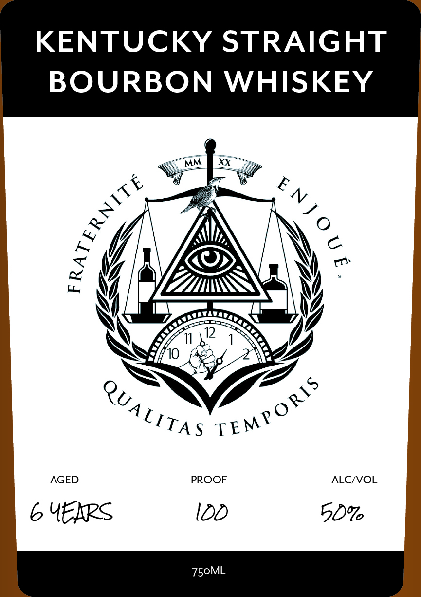

# TTB COLA Label Images - TTBID 26064001000197

**Brand Name:** WHISKEY THIEF DISTILLING CO.

**Fanciful Name:** FRATERNITE ENJOUE

**Issue Date:** 03/05/2026

**Origin Code:** 22

**Product Class/Type:** 101

**Source:** [TTB Public COLA Registry](https://ttbonline.gov/colasonline/viewColaDetails.do?action=publicFormDisplay&ttbid=26064001000197)

## Label Images

### Back Label

### Front Label

## Extracted Label Text

*Text extracted via OCR - may contain errors*

### Back Label

KENTUCKY STRAIGHT

BOURBON WHISKEY

AGED PROOF ALC/VOL

6 YEXRS l0D 5%

Barrel char and sediment may be present in this non-chill filtered whiskey.

UNFILTERED
BOTTLED BY WHISKEY THIEF
WHISKEy DISTILLING CO.

THIEF FRANKFORT, KENTUCKY

IN FRANKLIN COUNTY

DISTILLING

ose QD, 20002 STUDIO SERIES 2026

Franklin County NOT FOR RESALE 750ML

KENTUCKY

GOVERNMENT WARNING: (1) According to the Surgeon General, women should not drink
alcoholic beverages during pregnancy because of the risk of birth defects. (2) Consumption of
alcoholic beverages impairs your ability to drive a car or operate machinery, and may cause
health problems.

### Front Label

KENTUCKY STRAIGHT

BOURBON WHISKEY

« EY,

\( I

WAZA

|

2

NS

A

Pe,

“\VJ"

Oo

“IT as TEMS

AGED

PROOF

ALC/VOL

6 YEXRS

020

5O%

750ML
