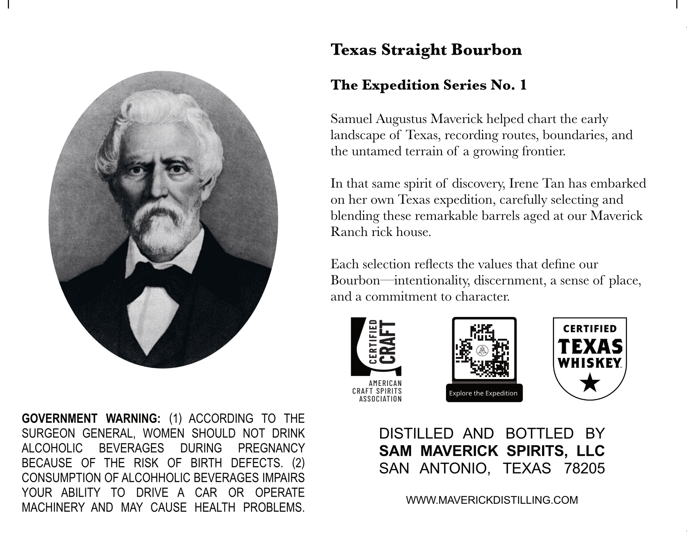
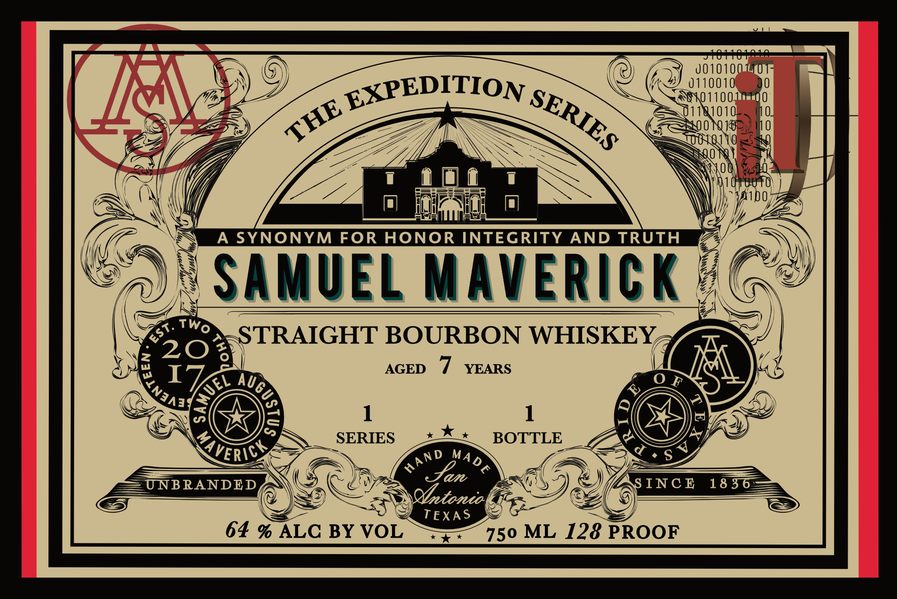

# TTB COLA Label Images - TTBID 26064001000436

**Brand Name:** SAMUEL MAVERICK

**Fanciful Name:** THE EXPEDITION SERIES

**Issue Date:** 03/05/2026

**Origin Code:** 44

**Product Class/Type:** 101

**Source:** [TTB Public COLA Registry](https://ttbonline.gov/colasonline/viewColaDetails.do?action=publicFormDisplay&ttbid=26064001000436)

## Label Images

### Back Label

### Front Label

## Extracted Label Text

*Text extracted via OCR - may contain errors*

**Detected Proof:** 128
**Detected Age:** 7 Years

### Back Label

Texas Straight Bourbon
The Expedition Series No. 1
Samuel Augustus Maverick helped chart the early
landscape of Texas, recording routes, boundaries, and
the untamed terrain of a growing frontier:
In that same spirit of discovery Irene Tan has embarked
on her own Texas
expedition, carefully selecting and
blending these remarkable barrels
at our Maverick
Ranch rick house.
Each selection reflects the values that define our
Bourbon
intentionality; discernment;
a sense of
place,
and a commitment to character:
CERTIFIED
8a
TEXAS
WHISKEY
AMERICAN
CRAFT SpiriTS
Explore the Expedition
association
GOVERNMENT
WARNING:  (1)
ACCORDING
To
THE
SURGEON GENERAL,
WOMEN
SHOULD
NOT
DRINK
DISTILLED
AND
BOTTLED
BY
ALCOHOLIC
BEVERAGES
DURING
PREGNANCY
SAM
MAVERICK   SPIRITS, LLC
BECAUSE
OF
THE
RISK
OF
BIRTH
DEFECTS.
(2)
SAN
ANTONIO ,
TEXAS
78205
CONSUMPTION OF ALCOHHOLIC BEVERAGES IMPAIRS
YOUR
ABILITY
TO
DRIVE
A
CAR
OR
OPERATE
WWWMAVERICKDISTILLING.COM
MACHINERY
AND
MAY
CAUSE
HEALTH
PROBLEMS.
aged

### Front Label

18
001010
I01=
0110010
EXPEDITION
0XO 1100-
181010
A SYNONYM FOR HONOR INTEGRITY
AND TRUTH
SAMUEL Maverick
STRAIGHT BOURBON WHISKEY
20
I
AGED
7
YEARS
AU
0 F
6
2
a
1
H
SERIES
BOTTLE
4
X
Jan
UNBRANDED
INC E
18 36
CYbetonion
TEXA S
64 % ALC BY VOL
750 ML 128 PROOF
SERIES
THE
Two
est:
2
(
EC
2
AVERICY
S V
d ,
AND
MADE
