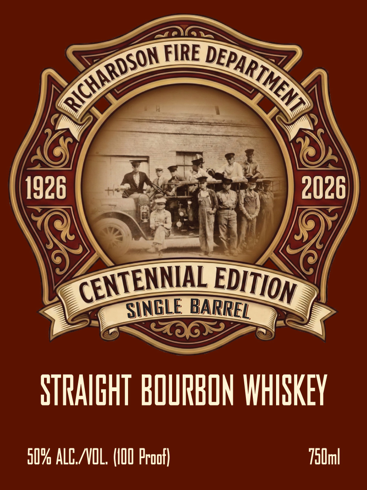
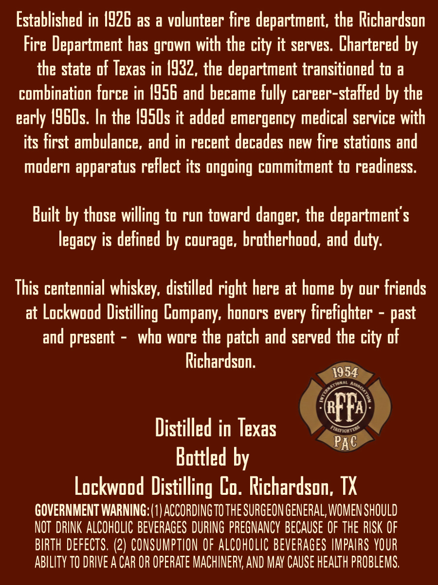

# TTB COLA Label Images - TTBID 26064001000446

**Brand Name:** RICHARDSON FIRE DEPARTMENT

**Issue Date:** 03/05/2026

**Origin Code:** 44

**Product Class/Type:** 101

**Source:** [TTB Public COLA Registry](https://ttbonline.gov/colasonline/viewColaDetails.do?action=publicFormDisplay&ttbid=26064001000446)

## Label Images

### Front Label

### Label 2

## Extracted Label Text

*Text extracted via OCR - may contain errors*

### Front Label

FIRE
1926
2026]
SINGLE
STRAIGHT BOURBON WHISKEY
509 ALG NNOL. (IOI Proof}
750ml
DEPARTMENT
RICHARDSON
CENTENNAL
EDITION
BARREL

### Label 2

Established in I926 as a volunteer fire department; the Richardson
Fire Department has grown with the city it serves: Chartered by
the state of Texas in 4932, the department transitioned to a
combination force in /956 and became fully career-staffed by the
early I9EUs. In the I95Us it added emergency medical service with
its first ambulance, and in recent decades new fire stations and
modern apparatus reflect its ongoing commitment to readiness:
Built by those willing to run toward
the department $
is defined by courage, brotherhood, and duty:
This centennial whiskey, distilled right here at home by our Friends
at Lockwood Distilling
honors every firefighter
and present
who wore the
and served the city of
Richardson.
1954
(FFA
Distilled in Texas
PaC
Bottled by
Lockwood Distilling Lo. Richardson; TX
GOVERNMENT WARNING: (1| ACCORDING TO THE SURGEON GENERAL, WOMEN SHOULD
NOT  DRINK ALCOHOLIC BEVERAGES DURING PREGNANCY BECAUSE OF THE RISK OF
BIRTH DEFECTS. (2) CONSUMPTION OF ALCOhOLIC beverages IMPAIRS VOUR
ABILITY TO DRIVE A CAR OR OpeRATe MACHINERV; AND MaV CAUSe HEALTh PROBLEMS,
danger;
legacy
Company,
past
patch
Tannch
