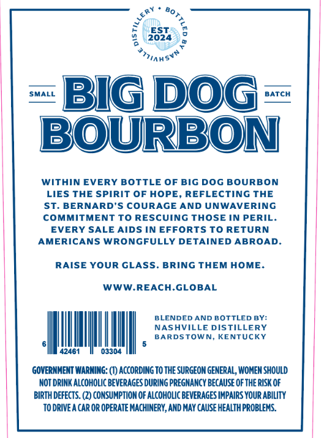
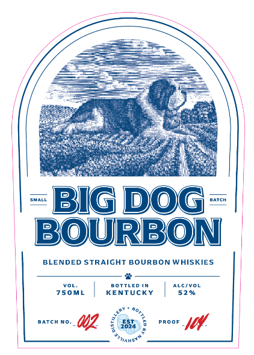

# TTB COLA Label Images - TTBID 26064001000477

**Brand Name:** BIG DOG BOURBON

**Issue Date:** 03/05/2026

**Origin Code:** 22

**Product Class/Type:** 121

**Source:** [TTB Public COLA Registry](https://ttbonline.gov/colasonline/viewColaDetails.do?action=publicFormDisplay&ttbid=26064001000477)

## Label Images

### Back Label

### Front Label

## Extracted Label Text

*Text extracted via OCR - may contain errors*

**Detected Proof:** 104

### Back Label

ES
2024
SMALL
Biq Dog
BATCH
BOURBON
Within EVERY BOTTLE OF
DOG BOURBON
LIES THE SPIRIT OF HOPE
REFLECTING THE
ST. BERNARD'S COURAGE AND UNWAVERING
COMMITMENT To RESCUING THOSE IN PERIL.
EVERY SALE AIDS IN EFFORTS TO RETURN
AMERICANS WRONGFULLY DETAINED ABROAD
RAISE YOUR GLASS
BRING THEM HOME.
WWWREACH-GLOBAL
BLENDED AND BOTTLED BY:
NASHVILLE DISTILLERY
BARDSTOWN
KENTUCKY
42461
03304
GOvERNMENT WARNING: (€) ACCORdING TO THE SURGEON GENERAL; WOHEN SHOULD
NOT DRINK ALCohOLIc BEVeRAGES durIng PREGNAncy Because OF The RISk OF
BIRTH DEFECTS. (2) CONSUMPTIOM OF ALcohOLIC BEVERAGES IMPAIRS YOUR ABility
TO DRIVe A CAr Or OPERATE MACHINERY, AND MAY CAUSE HEALTH PROBLEMS.
'T7i44
BIG

### Front Label

KMALL
Bg Dog
Match
BOURBON
BLENDED STRAIGHT BOURBON WHISKIES
B OTTLED
4LCiVOL
750ML
KENTUCKY
52 %
Atcp
PROOF
#miAHS"
